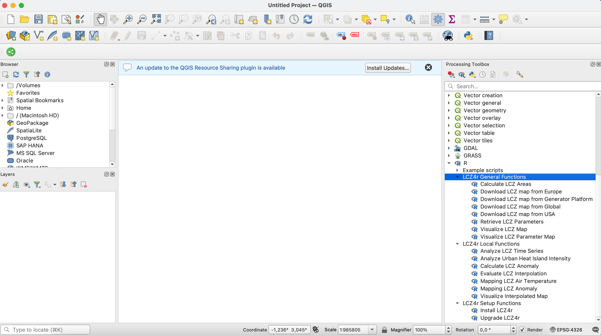
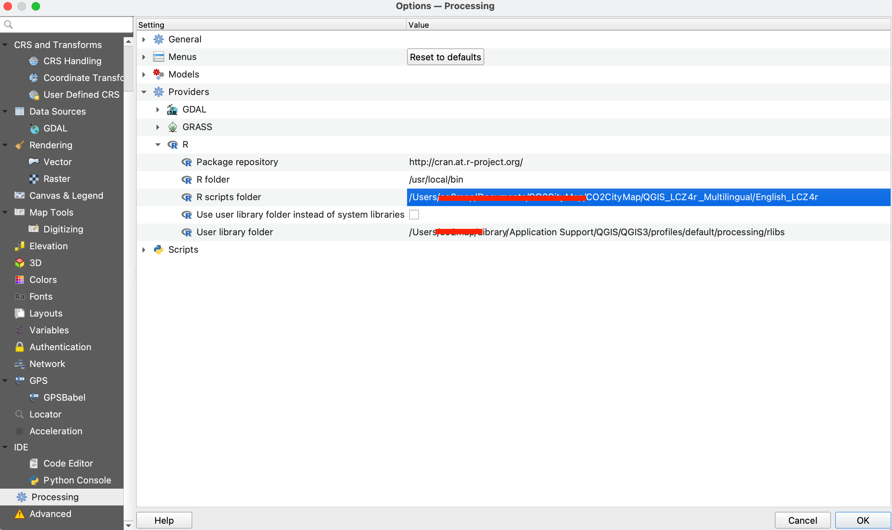

```{css, echo=FALSE}
/* ── Variáveis de Cores Modernas ────────────────── */
:root {
  --primary-color: #1D9E75;
  --dark-green: #0f3d2e;
  --bg-light: #f8faf9;
  --text-main: #1a1a1a;
  --code-bg: #fdfdfd;
  --qgis-blue: #5890be;
  --r-blue: #276dc3;
}

html {
  scroll-behavior: smooth;
}

body {
  font-family: 'Source Serif 4', Georgia, serif;
  font-size: 18px;
  color: var(--text-main);
  background-color: #fff;
}

/* ── Títulos com Inter-spacing ─────────────────── */
h1, h2, h3 {
  font-family: 'Inter', sans-serif;
  font-weight: 700;
  color: var(--dark-green);
}

h1.title {
  font-size: 2.8em;
  border-bottom: 4px solid var(--primary-color);
  padding-bottom: 10px;
}

/* ── Code Blocks Estilizados ────────────────────── */
pre.r {
  background-color: var(--code-bg);
  border: 1px solid #e1e1e1;
  border-left: 5px solid var(--primary-color) !important;
  border-radius: 8px;
  box-shadow: 0 2px 4px rgba(0,0,0,0.05);
}

/* ── Custom Callouts (Estilo Quarto) ────────────── */
.callout {
  padding: 1.2em;
  margin: 1.5em 0;
  border-radius: 0 8px 8px 0;
  border-left: 6px solid;
}

.callout-note {
  background-color: #f0f7ff;
  border-color: #007bff;
}

.callout-tip {
  background-color: #e8f5e9;
  border-color: #1D9E75;
}

.callout-warning {
  background-color: #fff3e0;
  border-color: #ff9800;
}

.callout-success {
  background-color: #e0f2e9;
  border-color: #1D9E75;
}

/* ── Transições suaves no menu lateral ──────────── */
.list-group-item.active, .list-group-item.active:focus, .list-group-item.active:hover {
  background-color: var(--primary-color);
  border-color: var(--primary-color);
}

/* ── Estilo para imagens ───────────────────────── */
.figure img {
  border-radius: 8px;
  box-shadow: 0 4px 8px rgba(0,0,0,0.1);
  transition: transform 0.3s ease;
  margin-bottom: 10px;
}

.figure img:hover {
  transform: scale(1.02);
}

.figure .caption {
  font-size: 0.9em;
  color: #666;
  margin-top: 5px;
  font-style: italic;
}

/* ── Step container styling ─────────────────────── */
.step-container {
  background-color: var(--bg-light);
  border-radius: 12px;
  padding: 1.5rem;
  margin: 1.5rem 0;
  border-left: 4px solid var(--primary-color);
}

.step-number {
  display: inline-block;
  background-color: var(--primary-color);
  color: white;
  width: 32px;
  height: 32px;
  border-radius: 50%;
  text-align: center;
  line-height: 32px;
  font-weight: bold;
  margin-right: 12px;
  font-size: 1rem;
}

.step-title {
  font-family: 'Inter', sans-serif;
  font-weight: 700;
  font-size: 1.3rem;
  color: var(--dark-green);
  margin-bottom: 1rem;
}

/* ── Video container ────────────────────────────── */
.video-container {
  position: relative;
  padding-bottom: 56.25%;
  height: 0;
  overflow: hidden;
  border-radius: 12px;
  margin: 1.5rem 0;
  box-shadow: 0 4px 12px rgba(0,0,0,0.1);
}

.video-container iframe {
  position: absolute;
  top: 0;
  left: 0;
  width: 100%;
  height: 100%;
  border-radius: 12px;
}

/* ── Badge styling ──────────────────────────────── */
.badge-version {
  background-color: #e9ecef;
  color: #495057;
  padding: 4px 8px;
  border-radius: 6px;
  font-size: 0.75rem;
  font-family: monospace;
  display: inline-block;
  margin-left: 8px;
}

/* ── Botão GitHub aprimorado ───────────────────── */
.github-feedback-btn {
  display: inline-flex;
  align-items: center;
  gap: 8px;
  background-color: #24292e;
  color: white;
  padding: 10px 20px;
  border-radius: 6px;
  text-decoration: none;
  font-family: sans-serif;
  transition: background-color 0.2s;
}

.github-feedback-btn:hover {
  background-color: #2c3e50;
  color: white;
  text-decoration: none;
}

/* ── Icon styling ───────────────────────────────── */
.icon-soft {
  width: 24px;
  height: 24px;
  vertical-align: middle;
  margin-right: 8px;
}
```

```{r setup, include=FALSE}
knitr::opts_chunk$set(
  echo    = TRUE,
  eval    = FALSE,
  warning = FALSE,
  message = FALSE,
  comment = "#>",
  fig.align = "center",
  out.width = "80%",
  fig.retina = 2
)
```

## 🚀 Getting Started: Installing LCZ4r in QGIS

Welcome to the **LCZ4r-QGIS plugin installation guide!** This document will walk you through the setup process to enable Local Climate Zone (LCZ) analysis within QGIS. With LCZ4r, you can enhance urban climate analysis by integrating advanced R functionalities directly into your GIS environment.

::: {.callout .callout-note}
**Why LCZ4r in QGIS?**

- **Seamless Integration**: Run R scripts directly from QGIS without switching applications
- **Spatial Analysis**: Leverage QGIS's powerful GIS capabilities alongside LCZ4r's climate analysis
- **Reproducible Workflows**: Document and share your analysis workflows easily
- **Multilingual Support**: Available in multiple languages for global accessibility
:::

## 📺 Video Tutorial

Watch this step-by-step video tutorial for a visual guide to the installation process:

<div class="video-container">
<iframe src="https://www.youtube.com/embed/qG_BbyDb-P8" 
        title="Installing LCZ4r in QGIS" 
        frameborder="0" 
        allow="accelerometer; autoplay; clipboard-write; encrypted-media; gyroscope; picture-in-picture" 
        allowfullscreen></iframe>
</div>

## 📌 Prerequisites

Before proceeding, ensure you have the following software installed:

<div class="step-container">
<div class="step-title">✅ Required Software</div>

| Software | Version | Purpose | Download |
|----------|---------|---------|----------|
| **QGIS** | 3.16 or higher | Geographic Information System | [qgis.org](https://qgis.org/) |
| **R** | 4.0 - 4.3 | Statistical computing environment | [cran.r-project.org](https://www.r-project.org/) |
| **Rtools** | Matching R version | R build tools (Windows only) | [CRAN](https://cran.r-project.org/bin/windows/Rtools/) |

</div>

::: {.callout .callout-tip}
**💡 Tip**: Ensure R is added to your system's PATH during installation. This allows QGIS to communicate with R seamlessly. On Windows, check "Add R to system PATH" during installation.
:::

## 🗃 Step-by-Step Installation Guide

### Step 1: Install R (Version 4.0 - 4.3)

<div class="step-container">
<span class="step-number">1</span> **Install R**

R is an open-source software environment for statistical computing and graphics, required to run LCZ4r scripts.

1. Download R (version 4.0 to 4.3) from CRAN for your operating system:
   - **Windows**: [R for Windows](https://cran.r-project.org/bin/windows/base/old/4.3.3/)
   - **macOS**: [R for macOS](https://cran.r-project.org/bin/macosx/)
   - **Linux**: [R for Linux](https://www.r-project.org/)

2. **Windows users only**: Install the corresponding version of [Rtools](https://cran.r-project.org/bin/windows/Rtools/) (must match your R version)

3. Verify installation by opening a terminal/command prompt and typing:
   ```bash
   R --version
   ```

</div>

### Step 2: Install the Processing R Provider in QGIS

<div class="step-container">
<span class="step-number">2</span> **Install Processing R Provider**

The Processing R Provider plugin allows you to run R scripts directly in QGIS.

1. Open **QGIS**
2. Go to **Plugins** → **Manage and Install Plugins...**
3. Search for "**Processing R Provider**"
4. Click **Install Plugin**
5. After installation, verify the plugin is activated in **Plugins** → **Installed**

```{r echo=F, out.width = '100%', fig.align='center'}

```

<div class="figure" style="text-align: center">

<p class="caption">The Processing R Provider plugin in QGIS Plugin Manager - ensure it shows as "Installed"</p>
</div>

</div>

### Step 3: Download and Configure LCZ4r Scripts

<div class="step-container">
<span class="step-number">3</span> **Configure LCZ4r Scripts**

Integrate LCZ4r functionality into QGIS by downloading and configuring the R scripts.

1. Visit the [Multilingual LCZ4r-QGIS Plugin page](https://bymaxanjos.github.io/LCZ4r/en/articles/examples.html)
2. [Download](https://bymaxanjos.github.io/LCZ4r/en/articles/examples.html#multilingual-plugins) the R scripts in your preferred language
3. Unzip the downloaded file and save the scripts in an easily accessible folder (e.g., `Documents/LCZ4r_scripts/`)
4. Open **QGIS** and navigate to:
   - **Settings** → **Options...** → **Processing** → **Providers** → **R**
5. Under **R scripts folder**, add the path to your LCZ4r scripts folder
6. **Disable** "Use user library instead of system libraries"
7. Click **OK** to save your settings

```{r echo=F, out.width = '100%', fig.align='center'}

```

<div class="figure" style="text-align: center">

<p class="caption">Setting the R scripts folder path in QGIS Processing options</p>
</div>

</div>

### Step 4: Verify Script Installation

<div class="step-container">
<span class="step-number">4</span> **Verify Installation**

If everything is configured correctly, you should see LCZ4r functions in the Processing Toolbox.

1. Open the **Processing Toolbox** in QGIS (View → Panels → Processing Toolbox)
2. Navigate to **R** → **Example Scripts**
3. You should see three LCZ4r categories:
   - **LCZ4r Setup Functions** - Installation and update tools
   - **LCZ4r General Functions** - Basic LCZ operations
   - **LCZ4r Local Functions** - Advanced climate analysis

</div>

### Step 5: Install LCZ4r Package and Dependencies

<div class="step-container">
<span class="step-number">5</span> **Install LCZ4r Package**

Run the installation script to set up all required R packages.

1. In the Processing Toolbox, expand **R** → **LCZ4r Setup Functions**
2. Double-click **Install LCZ4r**
3. Click **Run**

::: {.callout .callout-warning}
**⏱️ First Time Installation**: The first run may take 5-10 minutes as it installs all dependencies (over 50 packages). Please be patient!
:::

</div>

### Step 6: Run Your First LCZ4r Script

<div class="step-container">
<span class="step-number">6</span> **Test Your Installation**

Run a test script to confirm everything works correctly.

1. In the Processing Toolbox, expand **R** → **LCZ4r General Functions**
2. Double-click **Download LCZ map**
3. Enter your city name (e.g., "Berlin")
4. Click **Run**

🌟 **Success!** Once the process completes, you should see the output LCZ map in your QGIS canvas. Congratulations! You're now ready to explore all LCZ4r functions!

</div>

### Step 7: Regular Updates and Language Selection

<div class="step-container">
<span class="step-number">7</span> **Keep LCZ4r Updated**

To ensure you benefit from the latest improvements and language updates:

1. In the Processing Toolbox, expand **R** → **LCZ4r Setup Functions**
2. Double-click **Upgrade LCZ4r**
3. Select your preferred language from the dropdown menu
4. Click **Run**

::: {.callout .callout-tip}
**💡 Language Switching**: You can install multiple language versions. To switch languages, simply re-run the **Upgrade LCZ4r** script and select your preferred language.
:::

</div>

## 🔧 Troubleshooting Common Issues

| Issue | Possible Solution |
|-------|------------------|
| **R not found** | Ensure R is in your system PATH. Reinstall R with "Add to PATH" option |
| **Plugin not showing** | Restart QGIS after installing Processing R Provider |
| **Package installation fails** | Run as administrator (Windows) or check internet connection |
| **Scripts not appearing** | Verify R scripts folder path in Processing settings |
| **Language not changing** | Run Upgrade LCZ4r script again and select language |

## 📚 Next Steps

Now that LCZ4r is installed in QGIS, explore these resources:

- **General Functions**: Learn to download and visualize LCZ maps
- **Local Functions**: Analyze time series, thermal anomalies, and UHI intensity
- **Temperature Modeling**: Create interpolated temperature maps

## 📬 Have feedback or suggestions?

We welcome your feedback and suggestions! If you have ideas for improvements or spot any issues, please let us know. Click the button below to submit a new issue on our GitHub repository.

```{=html}
<a href='https://github.com/ByMaxAnjos/QGIS-LCZ4r-Multilingual/issues/new' class="github-feedback-btn">
  <svg xmlns="http://www.w3.org/2000/svg" width="18" height="18" viewBox="0 0 24 24" fill="currentColor">
    <path d="M12 0C5.37 0 0 5.37 0 12c0 5.31 3.435 9.795 8.205 11.385.6.105.825-.255.825-.57 0-.285-.015-1.23-.015-2.235-3.015.555-3.795-.735-4.035-1.41-.135-.345-.72-1.41-1.23-1.695-.42-.225-1.02-.78-.015-.795.945-.015 1.62.87 1.845 1.23 1.08 1.815 2.805 1.305 3.495.99.105-.78.42-1.305.765-1.605-2.67-.3-5.46-1.335-5.46-5.925 0-1.305.465-2.385 1.23-3.225-.12-.3-.54-1.53.12-3.18 0 0 1.005-.315 3.3 1.23.96-.27 1.98-.405 3-.405s2.04.135 3 .405c2.295-1.56 3.3-1.23 3.3-1.23.66 1.65.24 2.88.12 3.18.765.84 1.23 1.905 1.23 3.225 0 4.605-2.805 5.625-5.475 5.925.435.375.81 1.095.81 2.22 0 1.605-.015 2.895-.015 3.3 0 .315.225.69.825.57A12.02 12.02 0 0 0 24 12c0-6.63-5.37-12-12-12z"/>
  </svg>
  Open GitHub issue
</a>
```