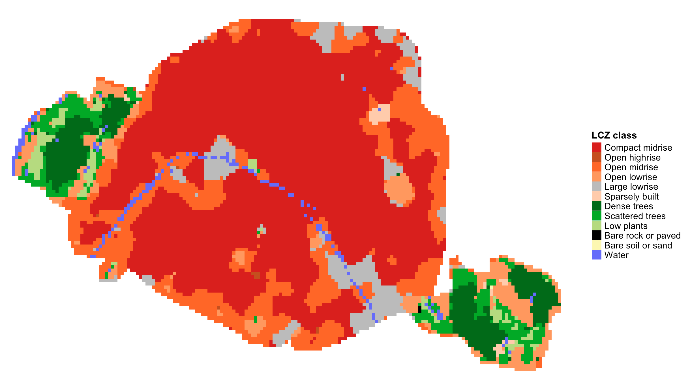
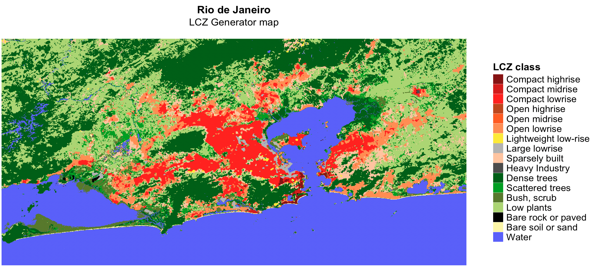
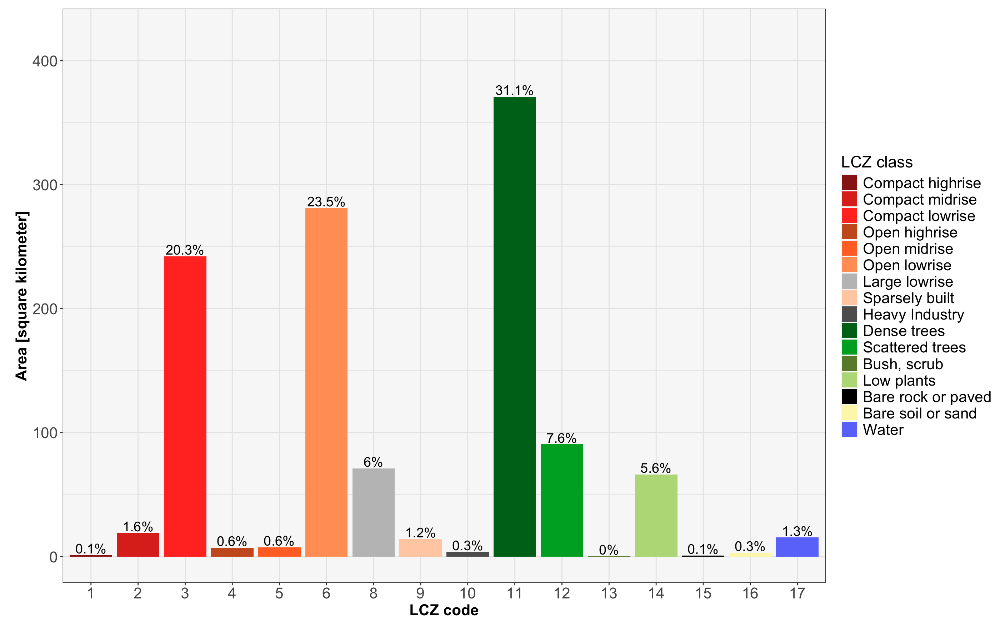
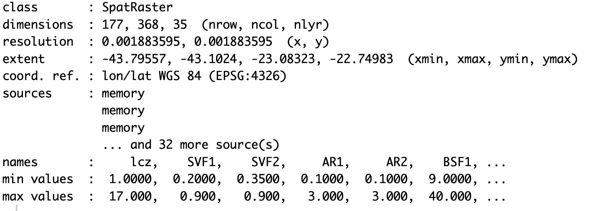

```{r, include = FALSE}
knitr::opts_chunk$set(
  collapse = TRUE,
  comment = "#>"
)
```

The **`LCZ4r` general functions** are designed to facilitate the retrieval, analysis, and visualization of LCZs, when data is not readily available. These functions enable users to download quickly LCZ maps, compute LCZ classes, and extract specific urban canopy parameters (UCPs) of interest, such as Sky View Factor, impervious surface fraction, and roughness element height and so on.

## Getting Started

The general functions, each serving a unique purpose:

| Function                | Description                                                | Data Required | Internet Access Required |
|------------------|------------------|-------------------|------------------|
| `lcz_get_map()`         | Download your LCZ map from Global dataset                    | Not needed    | Yes                      |
| `lcz_get_map_euro()`    | Download your LCZ map from European dataset                  | Not needed    | Yes                      |
| `lcz_get_map_usa()`     | Download your LCZ map from Continental United States dataset | Not needed    | Yes                      |
| `lcz_get_map_generator()`     | Download your LCZ map from LCZ Generator Platform | Not needed    | Yes                      |
| `lcz_get_map2()`        | Clip the LCZ map for your city or ROI                                        | Both    | Both              |
| `lcz_plot_map()`        | Visualize the LCZ map                                      | Not needed    | Not needed               |
| `lcz_cal_area()`        | Calculate LCZ areas                                        | Not needed    | Not needed               |
| `lcz_get_parameters()`  | Retrieve LCZ parameters                                    | Not needed    | Not needed               |
| `lcz_plot_parameters()` | Visualize LCZ parameters map                                  | Not needed    | Not needed               |

Tips: Utilize the help(lcz\_\*) function to access comprehensive documentation for each LCZ function. For instance, you can explore details about the lcz_get_map function by typing help("lcz_get_map").

## Download and visualize the LCZ map {.tabset .tabset-fade .tabset-pills}

The lcz_get_map() function facilitates obtaining the LCZ map for your chosen city or a specific Region of Interest (ROI). In our demonstration, we utilized a couple of cities around the world.

### São Paulo

```{r eval=FALSE, message=FALSE, warning=FALSE}
library(LCZ4r)
# Get the LCZ map for your city
lcz_map <- lcz_get_map(city="São Paulo")

# Visualize the obtained LCZ map
lcz_plot_map(lcz_map)

```

```{r echo=F, out.width = '100%', fig.align='center'}
knitr::include_graphics("fig_general_1_1.png")
```

### Paris

```{r eval=FALSE, message=FALSE, warning=FALSE}
euro_map <- lcz_get_map_euro(city="Paris")
lcz_plot_map(euro_map)

```

```{r echo=F, out.width = '100%', fig.align='center'}

```

### London

```{r eval=FALSE, message=FALSE, warning=FALSE}
euro_map <- lcz_get_map_euro(city="London")
lcz_plot_map(euro_map)

```

```{r echo=F, out.width = '100%', fig.align='center'}
knitr::include_graphics("fig_general_1_3.png")
```

### Sydney

```{r eval=FALSE, message=FALSE, warning=FALSE}
lcz_map <- lcz_get_map(city="Sydney")
lcz_plot_map(lcz_map)

```

```{r echo=F, out.width = '100%', fig.align='center'}
knitr::include_graphics("fig_general_1_4.png")
```

### Beijing

```{r eval=FALSE, message=FALSE, warning=FALSE}
lcz_map <- lcz_get_map(city="京")
lcz_plot_map(lcz_map)

```

```{r echo=F, out.width = '100%', fig.align='center'}
knitr::include_graphics("fig_general_1_5.png")
```

### New York

```{r eval=FALSE, message=FALSE, warning=FALSE}
usa_map <- lcz_get_map_usa(city = "New York")
lcz_plot_map(usa_map)

```

```{r echo=F, out.width = '100%', fig.align='center'}
knitr::include_graphics("fig_general_1_6.png")
```

### Nairobi

```{r eval=FALSE, message=FALSE, warning=FALSE}
my_map <- lcz_get_map(city = "Nairobi")
lcz_plot_map(my_map)

```

```{r echo=F, out.width = '100%', fig.align='center'}
knitr::include_graphics("fig_general_1_7.png")
```

##  {.unnumbered}

## Download LCZ map from LCZ Generator Platform

To seamlessly integrate LCZ maps into the LCZ4r package, follow these steps to obtain the ID code for your desired city:

* 1. **Access the LCZ Generator**: Visit the [LCZ Generator page](https://lcz-generator.rub.de/).
* 2. **Locate your city**: navigate to the [Submissions](https://lcz-generator.rub.de/submissions) section and search for your city using the search bar.
* 3. **Obtain the ID from Factsheet**: click **Show Factsheet** next to your city's submission and copy the **ID** from *Submission Information* section (e.g., **3110e623fbe4e73b1cde55f0e9832c4f5640ac21**) 

* 4. Example for Reference: View this sample [LCZ Factsheet](https://lcz-generator.rub.de/factsheets/3110e623fbe4e73b1cde55f0e9832c4f5640ac21/3110e623fbe4e73b1cde55f0e9832c4f5640ac21_factsheet.html) to understand the format and details.

```{r eval=FALSE, message=FALSE, warning=FALSE}
lcz_map <- lcz_get_map_generator(ID="3110e623fbe4e73b1cde55f0e9832c4f5640ac21")
lcz_plot_map(lcz_map)

```

```{r echo=F, out.width = '100%', fig.align='center'}

```

## 💡**Tip 1**: LCZ map for Region Of Interest (ROI)

This example demonstrates how to use the **roi** argument into lcz_get_map* functions to clip the LCZ map for your ROI.You must import shapefile into R.

```{r eval=FALSE, message=FALSE, warning=FALSE}
#Load package
library(sf)

#Import Shapefile int0 R
my_shp <- sf::st_read("path/shp_name.shp") #You also can use shapefile in .gpkg format

#Get LCZ map for your ROI
lcz_map <- lcz_get_map(roi = my_shp)

#Visualize LCZ map
lcz_plot_map(lcz_map)

```


## 💡**Tip 2**: Clip LCZ map generator for your city or Region Of Interest (ROI) using lcz_get_map2( )

This example demonstrates how to use the lcz_get_map2() function to clip the LCZ map for your specific city or ROI. For cities, the clipped map is derived from the OpenStreetMap database, while for ROIs, it uses your imported shapefile.

```{r eval=FALSE, message=FALSE, warning=FALSE}

#Get lcz map generator (e.g., Rio de Janeiro)
lcz_map_generator <- lcz_get_map_generator(ID="3110e623fbe4e73b1cde55f0e9832c4f5640ac21")

#Clip lcz map generator to your city 
lcz_map <- lcz_get_map2(lcz_map_generator, city = "Rio de Janeiro")

#Visualize LCZ map
lcz_plot_map(lcz_map)

#Clip lcz map generator to ROI
library(sf)
my_shp <- sf::st_read("path/shp_name.shp") #You also can use shapefile in .gpkg format
lcz_map <- lcz_get_map2(lcz_map_generator, roi = my_shp)

#Visualize LCZ map
lcz_plot_map(lcz_map)

```

```{r echo=F, out.width = '100%', fig.align='center'}
knitr::include_graphics("fig_general_7.png")
```


## Calculate LCZ areas

This `lcz_cal_area()` function calculates the area for each LCZ classes, as follows:

```{r eval=FALSE, message=FALSE, warning=FALSE}
lcz_map <- lcz_get_map(city="Rio de Janeiro")
lcz_cal_area(lcz_map)

```

```{r echo=F, out.width = '100%', fig.align='center'}

```

Tips: this function provides a table.csv of the calculated LCZ areas, coding like this: *lcz_cal_area(lcz_map, iplot = FALSE)*

## Retrieve and visualize LCZ parameters

This `lcz_get_parameters()`function gives you to retrieve diverse LCZ parameters, encompassing minimum, maximum, and mean values, drawn from Stewart and Oke (2012). These parameters are convertible into either shapefiles or a raster stack, where multiple rasters are aggregated into a single file.

Here's a glimpse of the available LCZ parameters:

| Code | Parameter                   | Description                         | Unit             |
|-----------------|-----------------|---------------------|-----------------|
| SVFmin | Sky View Factor             | Minimum Sky View Factor             | [0-1]            |
| SVFmax | Sky View Factor             | Maximum Sky View Factor             | [0-1]            |
| SVFmean | Sky View Factor             | Mean Sky View Factor                | [0-1]            |
| ARmin  | Aspect ratio                | Minimum Aspect Ratio                | [0-3]            |
| ARmax  | Aspect ratio                | Maximum Aspect Ratio                | [0-3]            |
| ARmean  | Aspect ratio                | Mean Aspect Ratio                   | [0-3]            |
| BSFmin | Building Surface Fraction   | Minimum Building Surface Fraction   | [%]              |
| BSFmax | Building Surface Fraction   | Maximum Building Surface Fraction   | [%]              |
| BSFmean | Building Surface Fraction   | Mean Building Surface Fraction      | [%]              |
| ISFmin | Impervious Surface Fraction | Minimum Impervious Surface Fraction | [%]              |
| ISFmax | Impervious Surface Fraction | Maximum Impervious Surface Fraction | [%]              |
| ISFmean | Impervious Surface Fraction | Mean Impervious Surface Fraction | [%]              |
| PSFmin | Vegetation Surface Fraction | Minimum Vegetation Surface Fraction | [%]              |
| PSFmax | Vegetation Surface Fraction | Maximum Vegetation Surface Fraction | [%]              |
| PSFmean | Vegetation Surface Fraction | Mean Vegetation Surface Fraction    | [%]              |
| TSFmin | Tree Surface Fraction       | Minimum Tree Surface Fraction       | [%]              |
| TSFmax | Tree Surface Fraction       | Maximum Tree Surface Fraction       | [%]              |
| TSFmean | Tree Surface Fraction       | Mean Tree Surface Fraction          | [%]              |
| HREmin | Height Roughness Elements   | Minimum Height Roughness Elements   | [meters]         |
| HREmax | Height Roughness Elements   | Maximum Height Roughness Elements   | [meters]         |
| HREmean | Height Roughness Elements   | Mean Height Roughness Elements      | [meters]         |
| TRCmin | Terrain Roughness class     | Minimum Terrain Roughness class     | [meters]         |
| TRCmax | Terrain Roughness class     | Maximum Terrain Roughness class     | [meters]         |
| TRCmean | Terrain Roughness class     | Mean Terrain Roughness class        | [meters]         |
| SADmin | Surface Admittance          | Minimum Surface Admittance          | [J m-2 s1/2 K-1] |
| SADmax | Surface Admittance          | Maximum Surface Admittance          | [J m-2 s1/2 K-1] |
| SADmean | Surface Admittance          | Mean Surface Admittance             | [J m-2 s1/2 K-1] |
| SALmin | Surface Albedo              | Minimum Surface Albedo              | [0-0.5]          |
| SALmax | Surface Albedo              | Maximum Surface Albedo              | [0-0.5]          |
| SALmean | Surface Albedo              | Mean Surface Albedo                 | [0-0.5]          |
| AHmin  | Anthropogenic Heat Outupt   | Minimum Anthropogenic Heat Outupt   | [W m-2]          |
| AHmax  | Anthropogenic Heat Outupt   | Maximum Anthropogenic Heat Outupt   | [W m-2]          |
| AHmean  | Anthropogenic Heat Outupt   | Mean Anthropogenic Heat Outupt      | [W m-2]          |
| z0   | Roughness Lenght            | Roughness Lenght class              | [meters]         |

## Rio de Janeiro LCZ parameters

```{r eval=FALSE, fig.height=7, fig.width=11, message=FALSE, warning=FALSE}
# Extract the LCZ parameters for raster stack format
lcz_map <- lcz_get_map(city="Rio de Janeiro")
LCZpar <- lcz_get_parameters(lcz_map, istack = TRUE)
LCZpar
```

```{r echo=F, out.width = '100%', fig.align='center'}

```

## Maps {.tabset .tabset-fade .tabset-pills}

### Sky View Factor

```{r eval=FALSE, message=FALSE, warning=FALSE}
lcz_plot_parameters(LCZpar, iselect = "SVFmean")
```

```{r echo=F, out.width = '100%', fig.align='center'}
knitr::include_graphics("fig_general_4.png")
```

### Building Surface Fraction

```{r eval=FALSE}
lcz_plot_parameters(LCZpar, iselect = "BSFmax")
```

```{r echo=F, out.width = '100%', fig.align='center'}
knitr::include_graphics("fig_general_5.png")
```

### Roughness Lenght

```{r eval=FALSE, fig.height=5, fig.width=9, message=FALSE, warning=FALSE}
lcz_plot_parameters(LCZpar, iselect = "z0")
```

```{r echo=F, out.width = '100%', fig.align='center'}
knitr::include_graphics("fig_general_6.png")
```


## Have feedback or suggestions?
Do you have an idea for improvement or did you spot a mistake? We'd love to hear from you! Click the button below to create a new issue (Github) and share your feedback or suggestions directly with us.

<button type="button" class="btn" style="background-color: #008000; color: white; padding: .25rem .5rem; font-size: .75rem; border: none; border-radius: .25rem;">
  <a href='https://github.com/ByMaxAnjos/LCZ4r/issues/new' style="text-decoration: none; color: white;">
    Open an issue in the Github repository
  </a>
</button>
