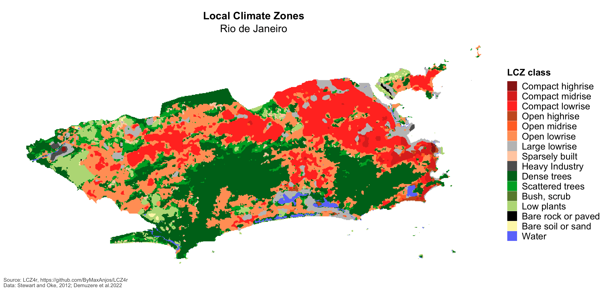
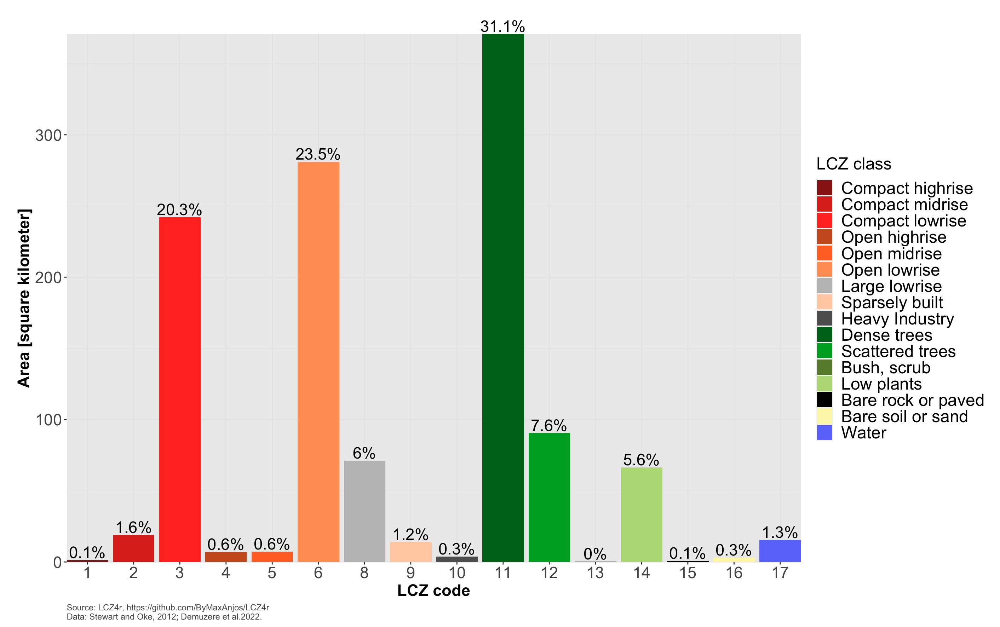
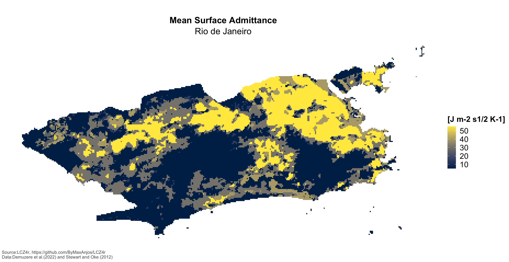

```{r , include = FALSE}
knitr::opts_chunk$set(
  collapse = FALSE,
  comment = "#" # comment = "#>" # tidy = FALSE #, out.width = '100%' #,  cache = FALSE
)
```

This vignette serves as an introduction to the **general functions of the `LCZ4r`** package. These functions comprise a suite of R tools designed to facilitate the retrieval, analysis, and visualization of Local Climate Zones (LCZ) when LCZ-specific data is not readily available. The **general functions** are engineered to compute LCZ classes and extract specific parameters of interest, including but not limited to the Sky View Factor (SVF), impervious surface fraction, and roughness element height, among others.

## Getting Started

The **LCZ4r** package fundamental functions, each serving a unique purpose:

| Function                | Description              | Data Required | Internet Access Required |
|--------------------|----------------|---------------------|----------------|
| `lcz_get_map()`         | Obtain the LCZ map       | Not needed    | Yes                      |
| `lcz_get_map2()`        | Obtain the LCZ map       | Not needed    | Not needed               |
| `lcz_plot_map()`        | Visualize the LCZ map    | Not needed    | Not needed               |
| `lcz_cal_area()`        | Calculate LCZ areas      | Not needed    | Not needed               |
| `lcz_get_parameters()`  | Retrieve LCZ parameters  | Not needed    | Not needed               |
| `lcz_plot_parameters()` | Visualize LCZ parameters | Not needed    | Not needed               |

Happy coding, and enjoy exploring the LCZ4r package!

## Obtain an visualize the LCZ map

The `lcz_get_map()` function allows you to obtain the LCZ map for your city or a specific Region of Interest (ROI) using the global LCZ map developed by Demuzere et al. (2022). In the rare cases when this function encounters inconsistencies, you can rely on the `lcz_get_map2()` as an alternative.

```{r eval=FALSE}

library(LCZ4r)
# Get the LCZ map for your city, e.g., "Rio de Janeiro"
lcz_map <- lcz_get_map(city="Rio de Janeiro")

# Visualize the obtained LCZ map
lcz_plot_map(lcz_map, isubtitle = "Rio de Janeiro")

```



## Calculate LCZ areas

This `lcz_cal_area()` function is designed to calculate the Local Climate Zone (LCZ) areas. You can use it like this:

```{r eval=FALSE}

#E.g., "Rio de Janeiro"
LCZarea <- lcz_cal_area(lcz_map, iplot = TRUE)
LCZarea
```



## Retrieve and visualize LCZ parameters

This `lcz_get_parameters()` function allows you to retrieve various LCZ parameters, including minimum, maximum, and mean values, sourced from Stewart and Oke (2012). These parameters can be converted into either shapefiles or raster stacks.

Here's a glimpse of the available LCZ parameters:

| Code | Parameter       | Description             | Unit  |
|------|-----------------|-------------------------|-------|
| SVF1 | Sky View Factor | Minimum Sky View Factor | [0-1] |
| SVF2 | Sky View Factor | Maximum Sky View Factor | [0-1] |
| SVF3 | Sky View Factor | Mean Sky View Factor    | [0-1] |

```{r eval=FALSE}

# Extract the LCZ parameters
LCZpar <- lcz_get_parameters(lcz_map, istack = TRUE)

# Visualize the selected parameter, for instance, "SVF1"
lcz_plot_parameters(LCZpar, iselect = "ADM3", isubtitle = "Rio de Janeiro")

```


