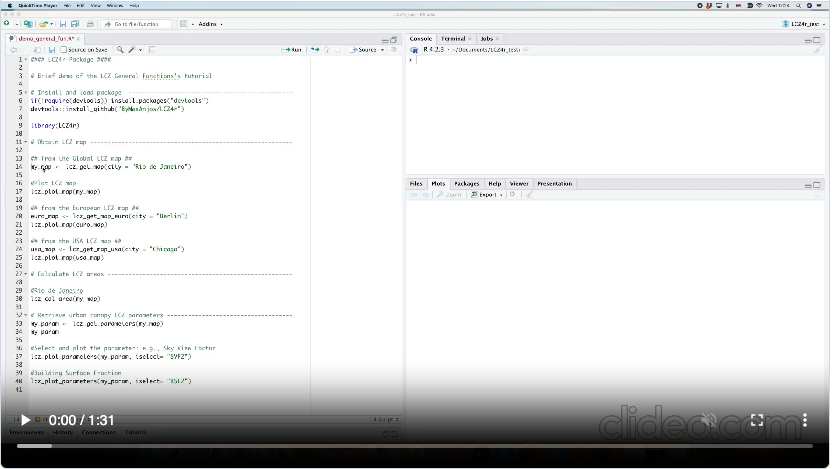
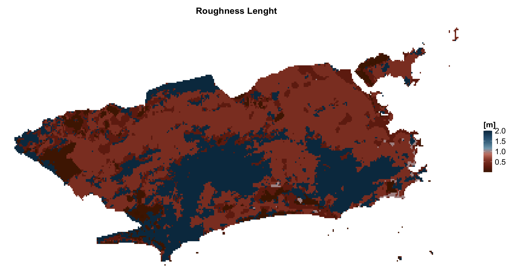

```{r, include = FALSE}
knitr::opts_chunk$set(
  collapse = TRUE,
  comment = "#>"
)
```

The **`LCZ4r` general functions** are designed to facilitate the retrieval, analysis, and visualization of Local Climate Zones (LCZ) when LCZ related data is not readily available. They are engineered to get the LZ map, compute LCZ classes, and extract specific parameters of interest, including Sky View Factor (SVF), impervious surface fraction, and roughness element height, among others.

## Quickstart DEMO video

<a href="https://github.com/ByMaxAnjos/LCZ4r/assets/94705218/a534cfaa-37d2-4c1d-8cec-e5e2a17e8806" target="_blank">
<p style="text-align:center;">

</p>
<p style="text-align:center">
(Click to Watch video)
</p>
</a>

## Getting Started

The general functions, each serving a unique purpose:

| Function                | Description                                                | Data Required | Internet Access Required |
|------------------|------------------|-------------------|------------------|
| `lcz_get_map()`         | Obtain your LCZ map from Global LCZ map                    | Not needed    | Yes                      |
| `lcz_get_map_euro()`    | Obtain your LCZ map from European LCZ map                  | Not needed    | Yes                      |
| `lcz_get_map_usa()`     | Obtain your LCZ map from Continental United States LCZ map | Not needed    | Yes                      |
| `lcz_get_map2()`        | Obtain the LCZ map                                         | Not needed    | Not needed               |
| `lcz_plot_map()`        | Visualize the LCZ map                                      | Not needed    | Not needed               |
| `lcz_cal_area()`        | Calculate LCZ areas                                        | Not needed    | Not needed               |
| `lcz_get_parameters()`  | Retrieve LCZ parameters                                    | Not needed    | Not needed               |
| `lcz_plot_parameters()` | Visualize LCZ parameters                                   | Not needed    | Not needed               |

Tips: Utilize the help(lcz\_\*) function to access comprehensive documentation for each LCZ function. For instance, you can explore details about the lcz_get_map function by typing help("lcz_get_map").

## Obtain an visualize the LCZ map

The lcz_get_map() function facilitates obtaining the LCZ map for your chosen city or a specific Region of Interest (ROI) by leveraging the global LCZ map developed by Demuzere et al. (2022). In our demonstration, we utilized Rio de Janeiro, Brazil as a reference city.

```{r eval=FALSE, message=FALSE, warning=FALSE}
library(LCZ4r)
# Get the LCZ map for your city
lcz_map <- lcz_get_map(city="Rio de Janeiro")

# Visualize the obtained LCZ map
lcz_plot_map(lcz_map, subtitle = "Rio de Janeiro")

```

```{r echo=F, out.width = '100%', fig.align='center'}
knitr::include_graphics("fig_general_1.png")
```

Here are some tips to enhance your experience:

1.  Fallback Option: In rare instances where the lcz_get_map() function faces inconsistencies (e.g., due to connectivity issues), you can rely on lcz_get_map2() as an alternative solution.
2.  Custom ROI: Utilize the lcz_get_map() function along with a shapefile for your ROI by coding lcz_get_map(roi="your_shp"). Refer to the R package [sf](https://r-spatial.github.io/sf/) documentation for guidance on loading the shapefile into R. \## Calculate LCZ areas

This `lcz_cal_area()` function calculates the area for each LCZ classes, as follows:

```{r eval=FALSE, message=FALSE, warning=FALSE}
lcz_cal_area(lcz_map)

```

```{r echo=F, out.width = '100%', fig.align='center'}
knitr::include_graphics("fig_general_2.png")
```

Tips: this function provides a table.csv of the calculated LCZ areas, coding like this: *lcz_cal_area(lcz_map, iplot = FALSE)*

## Retrieve and visualize LCZ parameters

This `lcz_get_parameters()`function gives you to retrieve diverse LCZ parameters, encompassing minimum, maximum, and mean values, drawn from Stewart and Oke (2012). These parameters are convertible into either shapefiles or a raster stack, where multiple rasters are aggregated into a single file.

Here's a glimpse of the available LCZ parameters:

| Code | Parameter                   | Description                         | Unit             |
|-----------------|-----------------|-----------------------|-----------------|
| SVF1 | Sky View Factor             | Minimum Sky View Factor             | [0-1]            |
| SVF2 | Sky View Factor             | Maximum Sky View Factor             | [0-1]            |
| SVF3 | Sky View Factor             | Mean Sky View Factor                | [0-1]            |
| AR1  | Aspect ratio                | Minimum Aspect Ratio                | [0-3]            |
| AR2  | Aspect ratio                | Maximum Aspect Ratio                | [0-3]            |
| AR3  | Aspect ratio                | Mean Aspect Ratio                   | [0-3]            |
| BSF1 | Building Surface Fraction   | Minimum Building Surface Fraction   | [%]              |
| BSF2 | Building Surface Fraction   | Maximum Building Surface Fraction   | [%]              |
| BSF3 | Building Surface Fraction   | Mean Building Surface Fraction      | [%]              |
| ISF1 | Impervious Surface Fraction | Minimum Impervious Surface Fraction | [%]              |
| ISF2 | Impervious Surface Fraction | Minimum Impervious Surface Fraction | [%]              |
| ISF3 | Impervious Surface Fraction | Minimum Impervious Surface Fraction | [%]              |
| PSF1 | Vegetation Surface Fraction | Minimum Vegetation Surface Fraction | [%]              |
| PSF2 | Vegetation Surface Fraction | Maximum Vegetation Surface Fraction | [%]              |
| PSF3 | Vegetation Surface Fraction | Mean Vegetation Surface Fraction    | [%]              |
| TSF1 | Tree Surface Fraction       | Minimum Tree Surface Fraction       | [%]              |
| TSF2 | Tree Surface Fraction       | Maximum Tree Surface Fraction       | [%]              |
| TSF3 | Tree Surface Fraction       | Mean Tree Surface Fraction          | [%]              |
| HRE1 | Height Roughness Elements   | Minimum Height Roughness Elements   | [meters]         |
| HRE2 | Height Roughness Elements   | Maximum Height Roughness Elements   | [meters]         |
| HRE3 | Height Roughness Elements   | Mean Height Roughness Elements      | [meters]         |
| TRC1 | Terrain Roughness class     | Minimum Terrain Roughness class     | [meters]         |
| TRC2 | Terrain Roughness class     | Maximum Terrain Roughness class     | [meters]         |
| TRC3 | Terrain Roughness class     | Mean Terrain Roughness class        | [meters]         |
| SAD1 | Surface Admittance          | Minimum Surface Admittance          | [J m-2 s1/2 K-1] |
| SAD2 | Surface Admittance          | Maximum Surface Admittance          | [J m-2 s1/2 K-1] |
| SAD3 | Surface Admittance          | Mean Surface Admittance             | [J m-2 s1/2 K-1] |
| SAL1 | Surface Albedo              | Minimum Surface Albedo              | [0-0.5]          |
| SAL2 | Surface Albedo              | Maximum Surface Albedo              | [0-0.5]          |
| SAL3 | Surface Albedo              | Mean Surface Albedo                 | [0-0.5]          |
| AH1  | Anthropogenic Heat Outupt   | Minimum Anthropogenic Heat Outupt   | [W m-2]          |
| AH2  | Anthropogenic Heat Outupt   | Maximum Anthropogenic Heat Outupt   | [W m-2]          |
| AH3  | Anthropogenic Heat Outupt   | Mean Anthropogenic Heat Outupt      | [W m-2]          |
| z0   | Roughness Lenght            | Roughness Lenght class              | [meters]         |

## Rio de Janeiro LCZ parameters

```{r eval=FALSE, fig.height=7, fig.width=11, message=FALSE, warning=FALSE}
# Extract the LCZ parameters for raster stack format
lcz_map <- lcz_get_map(city="Rio de Janeiro")
LCZpar <- lcz_get_parameters(lcz_map, istack = TRUE)
LCZpar
```

```{r echo=F, out.width = '100%', fig.align='center'}
knitr::include_graphics("fig_general_3.png")
```

## Maps {.tabset .tabset-fade .tabset-pills}

### Sky View Factor

```{r eval=FALSE, message=FALSE, warning=FALSE}
lcz_plot_parameters(LCZpar, iselect = "SVF3")
```

```{r echo=F, out.width = '100%', fig.align='center'}
knitr::include_graphics("fig_general_4.png")
```

### Building Surface Fraction

```{r eval=FALSE}
lcz_plot_parameters(LCZpar, iselect = "BSF2")
```

```{r echo=F, out.width = '100%', fig.align='center'}

```

### Roughness Lenght

```{r eval=FALSE, fig.height=5, fig.width=9, message=FALSE, warning=FALSE}
lcz_plot_parameters(LCZpar, iselect = "z0")
```

```{r echo=F, out.width = '100%', fig.align='center'}

```
