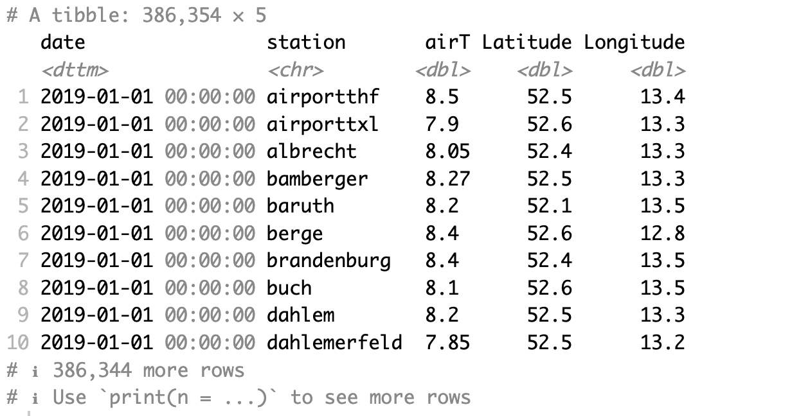
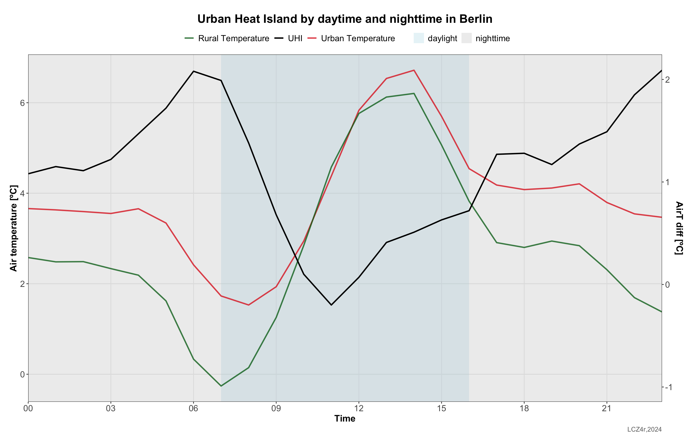

```{r, include = FALSE}
knitr::opts_chunk$set(
  collapse = TRUE,
  comment = "#>"
)
```

The **Local functions of LCZ4r** are tailored to handle larger-scale data inputs, such as datasets containing air temperature readings. In this tutorial, we focus on the city of Berlin as our reference location. Specifically, we utilize data collected from 23 meteorological stations situated across the city, which provide hourly time series of air temperature readings. These datasets are sourced from the Urban Climate Observatory (UCO).

## Getting Started

The **Local functions of `LCZ4r`**, each serving a unique purpose:

| Function              | Description                                | Data Required | Internet Access Required |
|-----------------|----------------------|-----------------|-----------------|
| `lcz_ts()`            | Analyze LCZ Time Series                    | Yes           | Optional\*               |
| `lcz_anamoly()`       | Calculate LCZ Thermal Anomalies            | Yes           | Optional                 |
| `lcz_anamoly_map()`   | Map LCZ Thermal Anomalies                  | Yes           | Optional                 |
| `lcz_interp_map()`    | Perform LCZ Interpolation                  | Yes           | Optional                 |
| `lcz_plot_interp()`   | Visualize LCZ Interpolation                | Yes           | Optional                 |
| `lcz_uhi_intensity()` | Assess LCZ for Urban Heat Island Intensity | Yes           | Optional                 |

\*Optional if you use the `lcz_get_map2()` function.

Tips: 1. Utilize the help(lcz\_\*) function to access comprehensive documentation for each LCZ function. For instance, you can explore details about the lcz_ts function by typing help("lcz_ts"); 2. Each of these functions includes imputation for missing values within the data.frame. Refer to the documentation of each function and check the "impute" argument for further details on how missing values are handled.

## Data inputs

For the local functions to operate smoothly, you should import the air temperature (or any other environmental variable) into R as a data frame, with columns structured as follows:

1.  *date*: This column should contain date-time information. This column must labeled "date".
2.  *Station*: Designate a column for meteorological station identifiers.
3.  *Air Temperature*: At least one column representing the air temperature variable.
4.  *Latitude* and *Longitude*: Two columns are required to specify the geographical coordinates.

It's important to note that the users should standardize the date-time format to R's conventions, such as "2023-03-13 11:00:00" or "2023-03-13". It also includes: e.g. "1/2/1999" or in format i.e. "YYYY-mm-dd", "1999-02-01".

To streamline this process, LCZ4r offers a sample data frame, accessible through the following way:

```{r eval=FALSE, message=FALSE, warning=FALSE}
library(LCZ4r)

#Load data from LCZ4r package
data("lcz_data")

#Check data structure out
str(lcz_data)

```

```{r echo=F, out.width = '100%', fig.align='center'}

```


## Analyze LCZ Time Series

With the `lcz_ts()` function, you can analyze the air temperature associated with LCZ classes over time. For instance, you can perform hourly frequency analysis of air temperature in Berlin for the years 2019-2020 using the "lcz_data" from the LCZ4r package.

```{r eval=FALSE, message=FALSE, warning=FALSE}
# Get the LCZ map for your city
lcz_map <- lcz_get_map_euro(city="Berlin")

#Let's get LCZ air temperature time series
lcz_ts(lcz_map, 
       data_frame = lcz_data, 
       var = "airT", 
       station_id = "station",
       time.freq = "month") # Monthly temporal frequency. Let's change to "hour, "day", "week", and so on.

```

```{r echo=F, out.width = '100%', fig.align='center'}
knitr::include_graphics("fig_local_2.png")
```


Additionally, you can customize this function:

**1. Flexibility time selection** You have the flexibility to select specific years and months for analysis. For example, you can specify a range of years (e.g., 1998:2004) or individual years (e.g., c(1998, 2004)). Similarly, you can select months either numerically (e.g., 1:6 for January to June) or by name (e.g., c("January", "December")). To illustrate, you can select data for September 1st, 2019, by including the arguments "year", "month", and "day" in the function call. See the [utility functions from the openair package](https://bookdown.org/david_carslaw/openair/sections/utilities/utility-functions.html#sec-selectByDate) for more details.

```{r eval=FALSE, fig.height=7, fig.width=11, message=FALSE, warning=FALSE}

#Selecting a couple of months
lcz_ts(lcz_map, data_frame = lcz_data, 
       var = "airT", station_id = "station",
       time.freq = "hour", 
       year = 2019, month = 1:3)

```

```{r echo=F, out.width = '100%', fig.align='center'}
knitr::include_graphics("fig_local_3.png")
```

**2. Splitting LCZ time series by temporal window or site** You can split data frame calling the *by* argument. The split available are "year", "season", "seasonyear", "month", "monthyear", "weekday", "weekend", "daylight" (daytime and nighttime). See argument [type in openair package:](https://bookdown.org/david_carslaw/openair/sections/intro/openair-package.html#the-type-option)

## Calculate LCZ Thermal Anomalies

The thermal anomaly is a great way to evaluate the intra-urban air temperatures differences. At each LCZ station, the thermal anomaly is defined as the difference between its temperature and the overall mean temperature of all LCZ stations. For instance, a positive temperature anomaly indicates that a particular LCZ is warmer compared to all other LCZs. The `lcz_anomaly()` function has the same utilities of the `lcz_ts()` regarding **Flexibility time selection** and **Splitting LCZ time series by temporal window or site**.

```{r eval=FALSE, message=FALSE, warning=FALSE}
# If you want the thermal anomalies for specific day
lcz_anomaly(lcz_map, 
            data_frame = lcz_data, 
            var = "airT", 
            station_id = "station", 
            time.freq = "hour", 
            year = 2019, month = 2, day = 6)
```

```{r echo=F, out.width = '100%', fig.align='center'}
knitr::include_graphics("fig_local_4.png")
```


```{r eval=FALSE, message=FALSE, warning=FALSE}
# Split thermal anomalies by daytime and nighttime periods
lcz_anomaly(lcz_map, 
            data_frame = lcz_data, 
            var = "airT", 
            station_id = "station", 
            time.freq = "hour", 
            year = 2019, month = 2, day = 6,
            by = "daylight")
```

```{r echo=F, out.width = '100%', fig.align='center'}

```


## Interpolating air temperature with LCZ 

If you're still with us and everything is running rightly, you can proceed to generate a map of the interpolated air temperatures using the `lcz_interp_map()` or `lcz_anomaly_map` function. This sort of function employs interpolation techniques, such as Kriging model, to estimates air temperatures based on the LCZ classes. The settings for time frequency and data splitting, as utilized in the `lcz_ts` and `lcz_anomaly()` functions, remain relatively unchanged. But, there are two new arguments to consider: **sp.res** (the spatial resolution of the map in meters) and **tp.res** (the frequency at which values are averaged). 
The `lcz_interp_map()` and `lcz_anomaly_map` functions return either a single raster file or a stack of raster files. Subsequently, you can visualize the  map using the `lcz_plot_interp()` function.


```{r eval=FALSE, message=FALSE, warning=FALSE}

#Mapping air temperatures for 6th February 2019 at 05:00h 
my_interp_map <- lcz_interp_map(lcz_map,
                                data_frame = lcz_data, 
                                var = "airT", station_id = "station",
                                sp.res = 100, tp.res = "hour",
                                 year = 2019, month = 2, day = 6, hour = 5)

#Customize map, with title, subtitle, etc.
lcz_plot_interp(my_interp_map, 
                title = "LCZ - air temperatures", 
                subtitle = "Berlin - 06.02.2019 at 05:00",
                caption = "Source: LCZ4r, 2024.",
                fill = "[ºC]")
```

```{r echo=F, out.width = '100%', fig.align='center'}
knitr::include_graphics("fig_local_6.png")
```


```{r eval=FALSE, warning=FALSE}

# Active the by argument! Mapping air temperature for each hour
my_interp_map <- lcz_interp_map(lcz_map,
                                data_frame = lcz_data, 
                                var = "airT", station_id = "station",
                                sp.res = 100, tp.res = "hour",
                                year = 2019, month = 2, day = 6,
                                by = "hour")

#Rename raster names with hour
names(my_interp_map) <- c(1:24)

lcz_plot_interp(my_interp_map, 
                title = "Hourly LCZ - air temperatures", 
                subtitle = "Berlin - 06.02.2019",
                caption = "Source: LCZ4r, 2024.",
                fill = "[ºC]")

```

```{r echo=F, out.width = '100%', fig.align='center'}
knitr::include_graphics("fig_local_7.png")
```

## Assess LCZ for Urban Heat Island Intensity

The `lcz_uhi_intensity()` function is designed to calculate the Urban Heat Island (UHI) intensity based on air temperature measurements and Local Climate Zones (LCZ). It provides two methods to calculate UHI intensity (UHII): LCZ and manual. In the LCZ method, the functions automatically identifies the LCZ build types, starting from LCZ 1 and progressing to LCZ 10, to represent the urban temperature, whilst it starts from LCZ natural LCZ (11-16) to represent the rural temperature. In the manual method, users have the freedom to select stations as references for the urban and rural areas.


```{r eval=FALSE, message=FALSE, warning=FALSE}

#Calculate hourly UHI intensity by months of 2019
lcz_uhi_intensity(lcz_map, data_frame = lcz_data, 
       var = "airT", station_id = "station",
       time.freq = "hour", 
       group = TRUE,
       method = "LCZ",
       year = 2019:2020,
       by = "month")
```

```{r echo=F, out.width = '100%', fig.align='center'}

```


```{r eval=FALSE, message=FALSE, warning=FALSE}

#Calculate hourly UHI intensity by daytime and nighttime
lcz_uhi_intensity(lcz_map, data_frame = lcz_data, 
       var = "airT", station_id = "station",
       time.freq = "hour", 
       group = TRUE,
       method = "LCZ",
       year = 2019, month = 2, day = 6,
       by = "daylight")
```

```{r echo=F, out.width = '100%', fig.align='center'}

```


