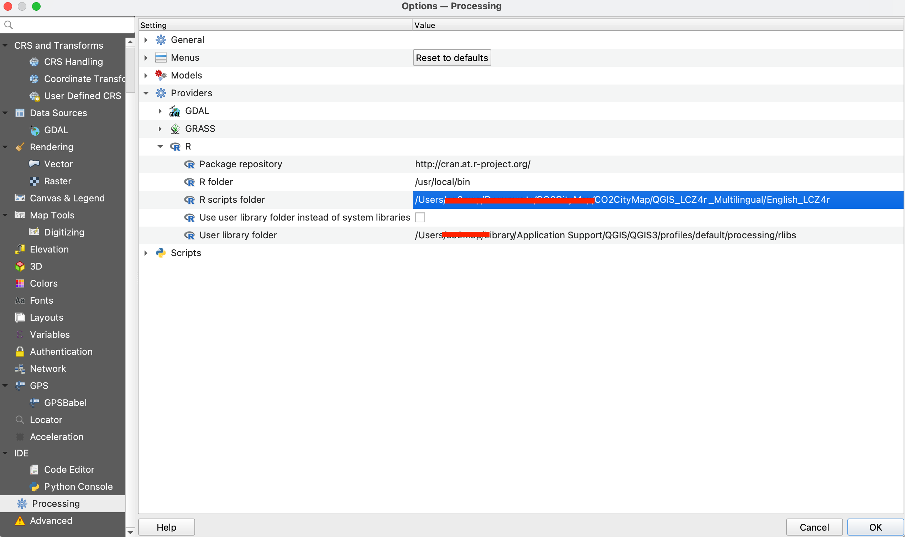
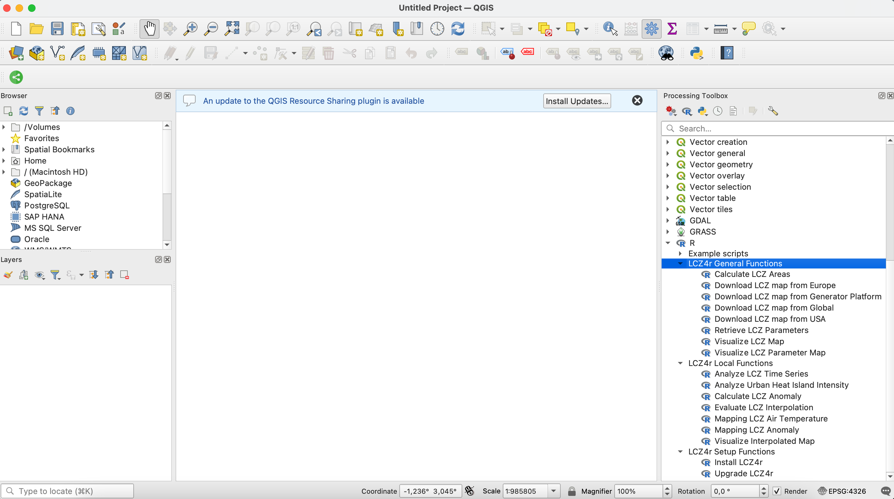

```{r, include = FALSE}
knitr::opts_chunk$set(
  collapse = TRUE,
  comment = "#>"
)
```

## 🚀 Getting Started: Installing LCZ4r in QGIS

Welcome to the **LCZ4r-QGIS plugin installation guide!** This document will guide you through the setup process to enable Local Climate Zone (LCZ) analysis within QGIS. With LCZ4r, you can enhance urban climate analysis by integrating advanced R functionalities directly into your GIS environment.

You can watch a detailed tutorial on installing LCZ4r in QGIS below: <!-- Embedded Video --> <iframe width="560" height="315" 
        src="https://www.youtube.com/embed/qG_BbyDb-P8" 
        title="Installing LCZ4r in QGIS" 
        frameborder="0" allow="accelerometer; autoplay; clipboard-write; encrypted-media; gyroscope; picture-in-picture" 
        allowfullscreen></iframe>

## 📌 Prerequisites

Before proceeding, ensure that you have the following:

-   **QGIS**: Download and install [QGIS](https://qgis.org/), a popular open-source Geographic Information System.
-   **R**: Download and install [R](https://www.r-project.org/) for statistical computing, which is essential for running LCZ4r scripts within QGIS.

## 🗃 Step-by-Step Installation Guide

### 1. Install R (Version <= 4.3)

The [R](https://www.r-project.org/) is an open-source software environment for statistical computing and graphics, required to run LCZ4r scripts. Follow these steps:

1.  Download and install R (version <= 4.3) from CRAN for your operating system: [Windows](https://cran.r-project.org/bin/windows/base/old/4.3.3/), [macOS](https://cran.r-project.org/bin/macosx/big-sur-arm64/base/), or [Linux](https://www.r-project.org/).
2.  If using Windows, also install the corresponding version of [Rtools](https://cran.r-project.org/bin/windows/Rtools/). 
3.  **Tip**: Ensure R is added to your system’s PATH so QGIS can interact with it.

### 2. Install the Processing R Provider in QGIS

The [Processing R provider](https://north-road.github.io/qgis-processing-r/) plugin allows you to run R scripts directly in QGIS. To install it:

1.  Open **QGIS** and go to **Plugins** \> **Manage** and Install **Plugins**.
2.  Search for "Processing R Provider" and click **Install**.
3.  Once installed, ensure the plugin is activated in **Plugins** \> **Installed**.

### 3. Download and install the LCZ4r Scripts

To integrate LCZ4r functionality into QGIS, you need to download the R scripts for your preferred language:

-   

    1.  Visit the [QGIS-LCZ4r Integration page](https://bymaxanjos.github.io/LCZ4r/articles/examples.html).

-   

    2.  [Download](https://bymaxanjos.github.io/LCZ4r/articles/examples.html#multilingual-plugins) the R scripts in your preferred language.

-   

    3.  Unzip the downloaded file and save the scripts in an easily accessible location.

-   

    4.  Open **QGIS** and got to **Settings** \> **Options...** \> **Processing** \> **Providers** \> **R**.

-   

    5.  Under **R scripts folder**, add the path where you saved the LCZ4r scripts.

-   

    6.  Disable **Use user library instead of system libraries**.

-   7.Click **OK** to confirm your setup.

```{r echo=F, out.width = '100%', fig.align='center'}

```

If everything is configured correctly, you will see **LCZ4r General Functions**, **LCZ4r Local Functions**, and **LCZ4r Setup Functions** in the *Processing Toolbox* \>*R* below Example Scripts.

```{r echo=F, out.width = '100%', fig.align='center'}

```

### 4. Install the LCZ4r package and additional necessary packages

Begin by running the **Install LCZ4r** function under **LCZ4r Setup Functions**. This step will install the LCZ4r package along with any additional necessary packages.

💡 *Please note that the first time you run this script, it may take longer as it installs all dependencies. Thank you for your patience!*

### 5. Run your first LCZ4r Script

Next, run the **Download LCZ map** function under **LCZ4r General Functions**.

🌟 *Once the process is complete, you should see the output LCZ map. Congratulations! You're now ready to explore the functions of the LCZ4r-QGIS plugin!*.

### 6. Upgrade LCZ4r regularly and select language functions

To ensure you benefit from the latest improvements (including new languages), run the **Upgrade LCZ4r** function under **LCZ4r Setup Functions**.

Select the folder where the script be stored. To do this, navigate first to the same directory where the scripts are installed:

🌟Open **QGIS** and got to **Settings** \> **Options...** \> **Processing** \> **Providers** \> **R** \> **R scripts folder**.

Next, select your language and click **Run**.

## 📬 Have feedback or suggestions?

We welcome your feedback and suggestions! If you have ideas for improvements or spot any issues, please let us know. Click the button below to submit a new issue on our GitHub repository.

<button type="button" class="btn" style="background-color: #008000; color: white; padding: .25rem .5rem; font-size: .75rem; border: none; border-radius: .25rem;">

<a href='https://github.com/ByMaxAnjos/QGIS-LCZ4r-Multilingual/issues/new'style="text-decoration: none; color: white;"> Open an issue in the Github repository </a>

</button>
