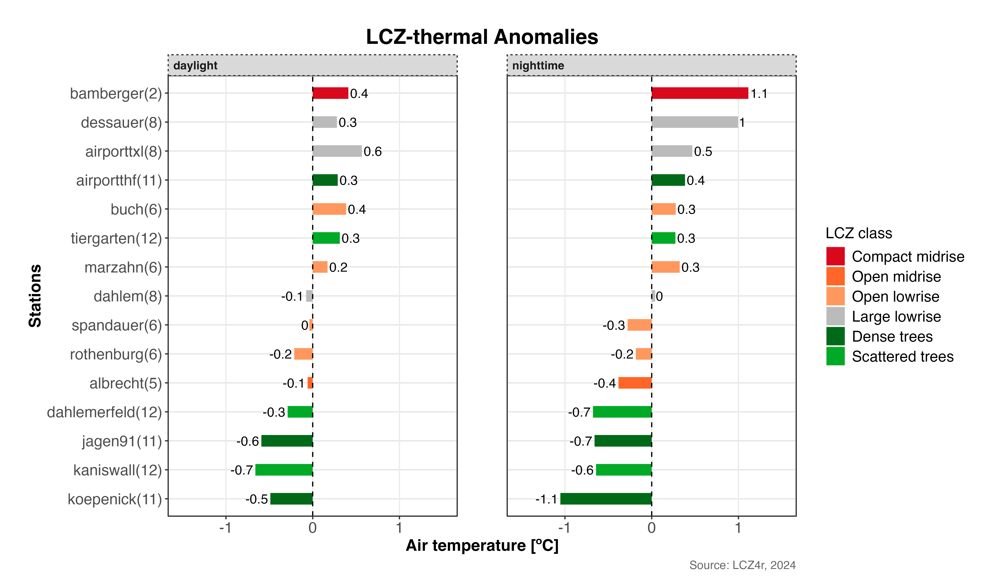

```{r, include = FALSE}
knitr::opts_chunk$set(
  collapse = TRUE,
  comment = "#>"
)
```

##  Getting Started

The thermal anomaly is a great way to evaluate the intra-urban air temperatures differences. At each LCZ station, the thermal anomaly is defined as the difference between its temperature and the overall mean temperature of all LCZ stations. For instance, a positive temperature anomaly indicates that a particular LCZ is warmer compared to all other LCZs. 

The `lcz_anomaly()` function has the same utilities of the `lcz_ts()` regarding **Flexibility time selection** and **Splitting LCZ time series by temporal window or site**.

## Plotting Options with plot_type

The plot_type argument in lcz_anomaly() offers several visualizations:

* *"diverging_bar"*: A horizontal bar plot that diverges from the center (zero), with positive anomalies extending to the right and negative anomalies to the left. 
* *"bar"*: A bar plot showing the magnitude of the anomaly for each station, colored by whether the anomaly is positive or negative. 
* *"dot"*: A dot plot that displays both the mean temperature values and the reference values, with lines connecting them. The size or color of the dots can indicate the magnitude of the anomaly
* *"lollipop"*: A lollipop plot where each "stick" represents an anomaly value and the dots at the top represent the size of the anomaly. 
Below are examples using each plot type.

```{r eval=FALSE, message=FALSE, warning=FALSE}
# Get the LCZ map for your city
lcz_map <- lcz_get_map_euro(city="Berlin")

# Load sample data from LCZ4r
data("lcz_data")

```

### 1. Diverging bar Plot

```{r eval=FALSE, message=FALSE, warning=FALSE}
# If you want the thermal anomalies for on 6th Feb 2019 at 05:00h
lcz_anomaly(lcz_map, 
            data_frame = lcz_data, 
            var = "airT", 
            station_id = "station", 
            time.freq = "hour", 
            year = 2019, month = 2, day = 6, hour=5,
            plot_type = "diverging_bar",
            ylab = "Air temperature [ºC]",
            xlab = "Stations",
            title = "LCZ-thermal Anomalies",
            caption = "Source: LCZ4r, 2024")
```

```{r echo=F, out.width = '100%', fig.align='center'}
knitr::include_graphics("fig_local_anomaly_1.png")
```

### 2. Bar plot

```{r eval=FALSE, message=FALSE, warning=FALSE}
# Bar plot for on 6th Feb 2019 at 05:00h
lcz_anomaly(lcz_map, 
            data_frame = lcz_data, 
            var = "airT", 
            station_id = "station", 
            time.freq = "hour", 
            year = 2019, month = 2, day = 6, hour=5,
            plot_type = "bar"
           )
```

```{r echo=F, out.width = '100%', fig.align='center'}

```

### 3. Dot plot

```{r eval=FALSE, message=FALSE, warning=FALSE}
# Dot plot for on 6th Feb 2019 at 05:00h
lcz_anomaly(lcz_map, data_frame = lcz_data, var = "airT", 
            station_id = "station", time.freq = "hour", 
            year = 2019, month = 2, day = 6, hour=5,
            plot_type = "dot"
            )
```

```{r echo=F, out.width = '100%', fig.align='center'}
knitr::include_graphics("fig_local_anomaly_3.png")
```

### 4. Lollipop plot

```{r eval=FALSE, message=FALSE, warning=FALSE}
# Dot plot for on 6th Feb 2019 at 05:00h
lcz_anomaly(lcz_map, data_frame = lcz_data, var = "airT", 
            station_id = "station", time.freq = "hour", 
            year = 2019, month = 2, day = 6, hour=5,
            plot_type = "lollipop"
            )
```

```{r echo=F, out.width = '100%', fig.align='center'}

```

## Splitting Anomalies with the "by" argument

```{r eval=FALSE, message=FALSE, warning=FALSE}
# Calculate anomalies for nighttime and daytime on 6th Feb 2019 
lcz_anomaly(lcz_map, data_frame = lcz_data, var = "airT", 
            station_id = "station", time.freq = "hour", 
            year = 2019, month = 2, day = 6, 
            plot_type = "diverging_bar",
            by = "daylight"
            )
```

```{r echo=F, out.width = '100%', fig.align='center'}

```

Combining daylight with months

```{r eval=FALSE, message=FALSE, warning=FALSE}
# Calculate monthly mean of anomalies for Feb and Oct 2019 
lcz_anomaly(lcz_map, data_frame = lcz_data, var = "airT", 
            station_id = "station", time.freq = "hour", 
            year = 2019, month = c(2, 8), 
            plot_type = "bar",
            by = c("daylight", "month")
            )
```

```{r echo=F, out.width = '100%', fig.align='center'}
knitr::include_graphics("fig_local_anomaly_6.png")
```

## Return a dataframe as result

To save return in R, set iplot = FALSE and create an object.

```{r eval=FALSE, message=FALSE, warning=FALSE}
#Return daylight dataframe on 15th January of 2020
my_output <- lcz_anomaly(lcz_map, data_frame = lcz_data, var = "airT", 
            station_id = "station", time.freq = "hour", 
            year = 2019, month = c(2, 8), 
            plot_type = "bar",
            by = c("daylight", "month"),
            iplot = FALSE
            )
```


