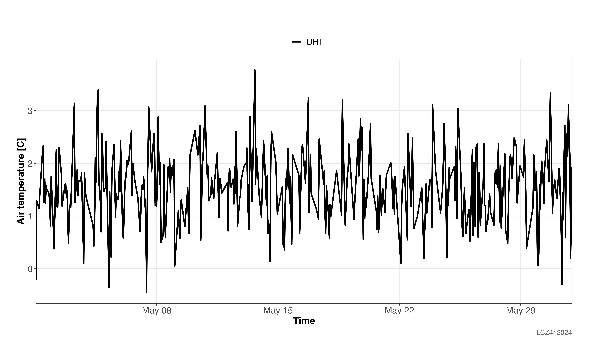
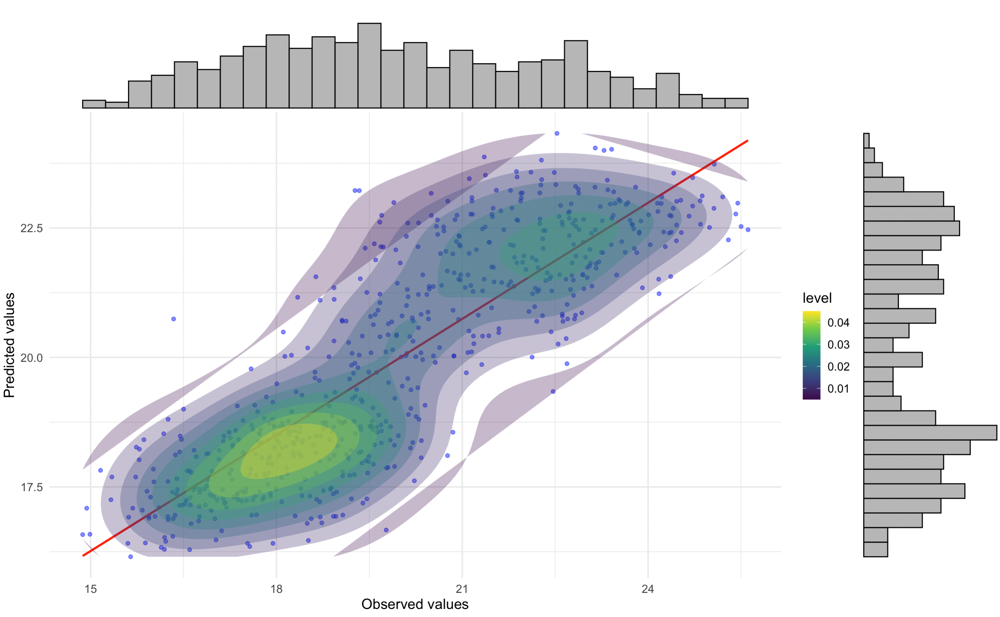
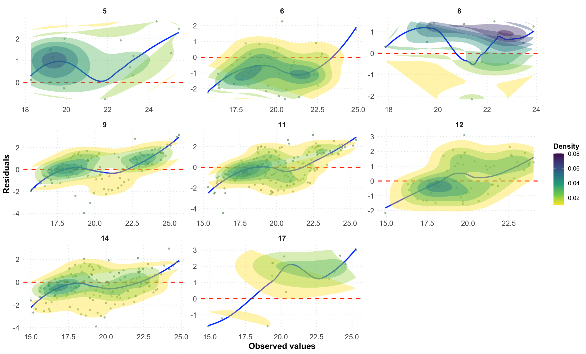

```{r, include = FALSE}
knitr::opts_chunk$set(
  collapse = TRUE,
  comment = "#>"
)
```

## Introduction

Urban Heat Islands (UHIs) are a critical environmental issue in cities, where urban areas experience higher temperatures than their rural surroundings. This case study demonstrates how to analyze UHIs using crowdsourced air temperature (Tair) data from Citizen Weather Stations (CWS) and the LCZ4r package in R. We focus on hourly Tair data from May 2023, collected by Netatmo CWS in Berlin, Germany, and available [“Crowd-QC” package in R](https://github.com/dafenner/CrowdQCplus).

## Load required packages
```{r eval=TRUE, message=FALSE, warning=FALSE}
# Install and load necessary packages
if (!require("pacman")) install.packages("pacman")
pacman::p_load(dplyr, sf, tmap, ggplot2, devtools)

library(LCZ4r) # For LCZ and UHI analysis
library(dplyr)  # For data manipulation
library(sf)         # For vector data manipulation
library(tmap)       # For interactive map visualization
library(ggplot2) #For data visualization
library(data.table)

#Install
if (!require("CrowdQCplus")) devtools::install_github("dafenner/CrowdQCplus")
library(CrowdQCplus) # For Quality Control of CWS data

```

## Dataset

```{r eval=FALSE, message=FALSE, warning=FALSE}
# Retrieve the LCZ map for Berlin using the LCZ Generator Platform
lcz_map <- lcz_get_map_generator(ID = "8576bde60bfe774e335190f2e8fdd125dd9f4299")

# Visualize the LCZ map
lcz_plot_map(lcz_map)

```

```{r echo=F, out.width = '100%', fig.align='center'}
knitr::include_graphics("fig_local_modeling_crows_1.png")
```

### Load and visualize CWS data

```{r eval=TRUE, message=FALSE, warning=FALSE}
# Load sample CWS data for Berlin from the CrowdQCplus package
data(cqcp_cws_data)
head(cqcp_cws_data)

```

### Visualize CWS stations

```{r eval=TRUE, message=FALSE, warning=FALSE, out.width = '100%', fig.align='center'}
# Convert CWS stations to an sf object for spatial analysis
shp_stations <- cqcp_cws_data %>%
  distinct(lon, lat, .keep_all = TRUE) %>%
  st_as_sf(coords = c("lon", "lat"), crs = 4326)

# Visualize CWS stations on an interactive map
tmap_mode("view")
qtm(shp_stations)

```

### Quality Control of CWS data

To ensure data reliability, we applied the quality control (QC) method developed by [Fenner et al. (2021)](https://www.frontiersin.org/journals/environmental-science/articles/10.3389/fenvs.2021.720747/full) using the CrowdQCplus package. This process filters out statistically implausible readings, improving data accuracy.

After applying QC, multiple columns are generated. For air temperature interpolation, we selected the "ta_int" column from the "data_qc" dataframe, as it represents temperature values that successfully passed all quality control steps.

```{r eval=TRUE, message=FALSE, warning=FALSE}
# Perform data padding and input checks
data_crows <- cqcp_padding(cqcp_cws_data)
data_check <- cqcp_check_input(data_crows)

# Apply quality control
if (data_check) {
   data_qc <- cqcp_qcCWS(data_crows) # QC
}

head(data_qc)

```


```{r eval=TRUE, message=FALSE, warning=FALSE}
# Display QC output statistics
n_data_qc <- cqcp_output_statistics(data_qc)

```

## Dive into CWS LCZs

### Diurnal Cycle of Air Temperature

We examined the diurnal cycle of air temperature for a specific day (May 1, 2023) across different LCZs.

```{r eval=FALSE, message=FALSE, warning=FALSE}
cws_ts <- lcz_ts(lcz_map, data_frame = data_qc,
                var = "ta_int", station_id = "p_id",
                time.freq = "hour",
                extract.method = "two.step",
                year = 2023, month = 5, day = 1,
                by = "daylight")
cws_ts

```


```{r echo=F, out.width = '100%', fig.align='center'}
knitr::include_graphics("fig_local_modeling_crows_2.png")
```

## Urban heat island Analysis

### Intensity

We calculated hourly UHI intensities for May 2023 using the LCZ method, which automatically selects urban and rural temperatures based on LCZ classes. The highest UHI intensity observed was 3.7°C on May 13 at 16:00.

```{r eval=FALSE, message=FALSE, warning=FALSE}

cws_uhi <- lcz_uhi_intensity(lcz_map, data_frame = data_qc,
                var = "ta_int", station_id = "p_id",
                time.freq = "hour",
                extract.method = "two.step",
                year = 2023, month = 5,
                method = "LCZ")
cws_uhi

```

```{r echo=F, out.width = '100%', fig.align='center'}

```

### UHI mapping

We modeled the UHI for May 13, 2023, at 16:00, using LCZ-based spatial interpolation.

```{r eval=FALSE, message=FALSE, warning=FALSE}
# Map air temperatures for 2023-05-13 at 16h.
my_interp_map <- lcz_interp_map(
  lcz_map,
  data_frame = data_qc,
  var = "ta_int",
  station_id = "p_id",
  sp.res = 100,
  tp.res = "hour",
  year = 2023, month = 5, day = 13, hour = 16
)

# Customize the plot with titles and labels
lcz_plot_interp(
  my_interp_map,
  title = "Thermal field - CWS data",
  subtitle = "Berlin - 2023-05-13 at 16h",
  caption = "Source: LCZ4r, 2024.",
  fill = "[ºC]")

```

```{r echo=F, out.width = '100%', fig.align='center'}
knitr::include_graphics("fig_local_modeling_crows_6.png")
```


```{r eval=FALSE, message=FALSE, warning=FALSE}
# Map air temperatures for 2023-05-13 at 16h.
my_anomaly_map <- lcz_anomaly_map(
  lcz_map,
  data_frame = data_qc,
  var = "ta_int",
  station_id = "p_id",
  sp.res = 100,
  tp.res = "hour",
  year = 2023, month = 5, day = 13, hour = 16
)

# Customize the plot with titles and labels
lcz_plot_interp(
  title = "Thermal anomaly field - CWS data",
  subtitle = "Berlin - 2023-05-13 at 16h",
  caption = "Source: LCZ4r, 2024.",
  fill = "[ºC]", 
  palette = "bl_yl_rd")

```

```{r echo=F, out.width = '100%', fig.align='center'}
knitr::include_graphics("fig_local_modeling_crows_7.png")
```

### Evaluate UHI map

We evaluated the interpolation accuracy using Leave-One-Out Cross-Validation (LOOCV) and calculated metrics such as RMSE, MAE, and sMAPE.

```{r eval=FALSE, message=FALSE, warning=FALSE}
# Evaluate the interpolation
df_eval <- lcz_interp_eval(
  lcz_map,
  data_frame = data_qc,
  var = "ta_int",
  station_id = "p_id",
  year = 2023, month = 5, day = 13, 
  LOOCV = TRUE,
  extract.method = "two.step",
  sp.res = 500,
  tp.res = "hour",
  vg.model = "Sph",
  LCZinterp = TRUE
)

```

### Evaluation metrics

Based on the table results, we calculate evaluation metrics (RMSE, MAE MAPE) to quantify uncertainties.

```{r eval=FALSE, message=FALSE, warning=FALSE}
#Calculate metrics
df_eval_metrics <- df_eval %>%
  group_by(lcz) %>%
  summarise(
    rmse = sqrt(mean((observed - predicted)^2)), # RMSE
    mae = mean(abs(observed - predicted)),      # MAE
    smape = mean(2 * abs(observed - predicted) / (abs(observed) + abs(predicted)) * 100) # sMAPE
  )

df_eval_metrics

```

### Correlation and Residual Analysis

We analyzed the correlation between observed and predicted values and examined residuals by LCZ.

```{r eval=FALSE, message=FALSE, warning=FALSE}

# Correlation plot with regression equation and R2
p1 <- ggplot(df_eval, aes(x = observed, y = predicted)) +
  geom_point(alpha = 0.5, color = "blue") + # Scatter points
  geom_smooth(method = "lm", color = "red", se = FALSE) + # Regression line
  stat_density2d(aes(fill = ..level..), geom = "polygon", alpha = 0.3) + # Density contours
  scale_fill_viridis_c() + # Viridis color scale for density
  stat_poly_eq(
    aes(label = paste(..eq.label.., ..rr.label.., sep = "~~~")),
    formula = y ~ x,
    parse = TRUE,
    label.x.npc = "left", # Position of the equation
    label.y.npc = "top"
  ) + # Add regression equation and R2
  labs(
    title = "",
    x = "Observed values",
    y = "Predicted values"
  ) +
  theme_minimal(base_size = 14) # Minimal theme for elegance

# Add marginal histograms
p1_with_marginals <- ggExtra::ggMarginal(p1, type = "histogram", fill = "gray", bins = 30)

# Print the plot
p1_with_marginals

```


```{r echo=F, out.width = '100%', fig.align='center'}

```


```{r eval=FALSE, message=FALSE, warning=FALSE}

# Residuals plot by LCZ
p2 <- ggplot(df_eval, aes(x = observed, y = residual)) +
  # Scatter points with transparency for better visibility
  geom_point(alpha = 0.4, color = "darkgreen", size = 1) +
  # Horizontal reference line at 0
  geom_hline(yintercept = 0, linetype = "dashed", color = "red", size = 0.8) +
  # Loess smoothing line for trend
  geom_smooth(method = "loess", color = "blue", se = FALSE, size = 1) +
  #Density contours for point concentration
  stat_density2d(aes(fill = ..level..), geom = "polygon", alpha = 0.4) +
  scale_fill_viridis_c(option = "D", direction = -1) + # Viridis color scale
  # Facet by LCZ with free scales
  facet_wrap(~ lcz, scales = "free", ncol = 3) +
  # Labels and titles
  labs(
    title = "",
    x = "Observed values",
    y = "Residuals",
    fill = "Density"
  ) +
  
  # Customize 
  theme_minimal(base_size = 14) +
  theme(
    plot.title = element_text(size = 16, face = "bold", hjust = 0.5), # Centered bold title
    axis.title = element_text(size = 14, face = "bold"), # Bold axis titles
    axis.text = element_text(size = 12), # Axis text size
    strip.text = element_text(size = 12, face = "bold"), # Facet labels
    legend.position = "right", # Place legend on the right
    legend.title = element_text(size = 12, face = "bold"), # Bold legend title
    legend.text = element_text(size = 10), # Legend text size
    panel.grid.major = element_line(color = "gray90", linetype = "dotted"), # Subtle gridlines
    panel.grid.minor = element_blank()
  )

# Print the plot
p2

```

```{r echo=F, out.width = '100%', fig.align='center'}

```


## Have feedback or suggestions?
Do you have an idea for improvement or did you spot a mistake? We'd love to hear from you! Click the button below to create a new issue (Github) and share your feedback or suggestions directly with us.

<button type="button" class="btn" style="background-color: #008000; color: white; padding: .25rem .5rem; font-size: .75rem; border: none; border-radius: .25rem;">
  <a href='https://github.com/ByMaxAnjos/LCZ4r/issues/new' style="text-decoration: none; color: white;">
    Open an issue in the Github repository
  </a>
</button>


