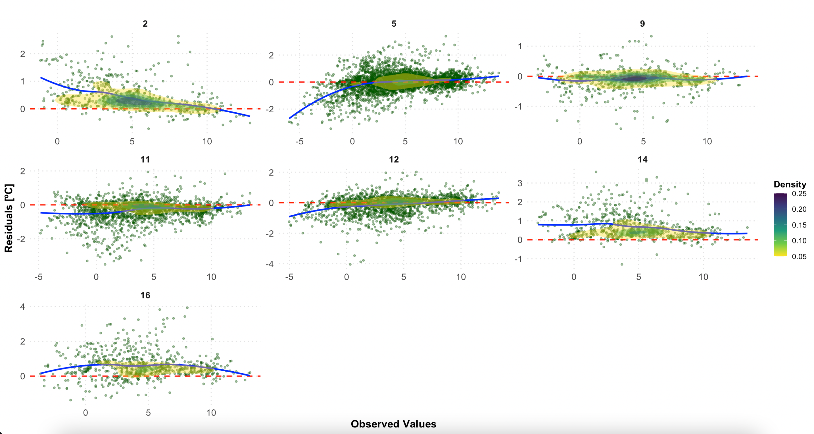

```{r, include = FALSE}
knitr::opts_chunk$set(
  collapse = TRUE,
  comment = "#>"
)
```

## Introduction

Quantifying interpolated air temperature is crucial for climate research, especially when the results are used for various applications. The LCZ4r package provides the `lcz_interp_eval()`  function to assess LCZ-based interpolation. In this tutorial, we’ll demonstrate how to use this function to evaluate air temperature interpolation across Berlin, Germany. We’ll calculate and visualize evaluation metrics.

## Load package
```{r eval=TRUE, message=FALSE, warning=FALSE}
if (!require("pacman")) install.packages("pacman")
pacman::p_load(dplyr, sf, tmap, ggplot2, ggExtra, ggpmisc)

library(LCZ4r) # For LCZ and UHI analysis
library(dplyr)  # For data manipulation
library(sf)         # For vector data manipulation
library(tmap)       # For interactive map visualization
library(ggplot2) #For data visualization
library(ggExtra) # For marginal histograms
library(ggpmisc) # For regression equation and R2
```

## Dataset

```{r eval=FALSE, message=FALSE, warning=FALSE}
# Get the LCZ map for Berlin using the LCZ Generator Platform
lcz_map <- lcz_get_map_generator(ID = "8576bde60bfe774e335190f2e8fdd125dd9f4299")

# Optional: Clip the LCZ map to the Berlin area
lcz_map <- lcz_get_map2(lcz_map, city = "Berlin")

# Visualize the LCZ map
lcz_plot_map(lcz_map)
```

```{r echo=F, out.width = '100%', fig.align='center'}
knitr::include_graphics("fig_local_modeling_eval_1.png")
```

### Load sample Berlin data

```{r eval=FALSE, message=FALSE, warning=FALSE}
# Load sample Berlin data from the LCZ4r package
data("lcz_data")
view(lcz_data)

```

```{r echo=F, out.width = '100%', fig.align='center'}
knitr::include_graphics("fig_local_modeling_eval_3.png")
```


### Visualize stations

```{r eval=TRUE, message=FALSE, warning=FALSE, out.width = '100%', fig.align='center'}
# Convert the data to an sf object
shp_stations <- lcz_data %>%
  distinct(Longitude, Latitude, .keep_all = TRUE) %>%
  st_as_sf(coords = c("Longitude", "Latitude"), crs = 4326)

# Visualize the stations on an interactive map
tmap_mode("view")
qtm(shp_stations, text = "station")

```
## Demo: interpolate map for a specific hour of day

```{r eval=FALSE, message=FALSE, warning=FALSE}
Copy
# Map air temperatures for June 2, 2020, at 15:00
my_interp_map <- lcz_interp_map(
  lcz_map,
  data_frame = lcz_data,
  var = "airT",
  station_id = "station",
  sp.res = 100,
  tp.res = "hour",
  year = 2020,
  month = 7,
  day = 6,
  hour = 13
)

# Customize the plot with titles and labels
lcz_plot_interp(
  my_interp_map,
  title = "Thermal Field",
  subtitle = "Berlin - July 6, 2020 at 13:00",
  caption = "Source: LCZ4r, 2024.",
  fill = "[ºC]"
)

```

Wow! That's great. We can see a well-defined urban heat island in central areas.

```{r echo=F, out.width = '100%', fig.align='center'}
knitr::include_graphics("fig_local_modeling_eval_2.png")
```

## Evaluate a spatial and temporal interpolation 

The key question is: How confident is the interpolated map?  To address this, we use the lcz_interp_eval() function to quantify the related error, which is crucial for understanding how well the LCZ-based interpolation predicts air temperatures.

### key fatures of lcz_interp_eval()

This function evaluates the variability of spatial and temporal interpolation of a variable (e.g., air temperature) using LCZ as a background. It supports both LCZ-based and conventional interpolation methods. The function allows for flexible time period selection, cross-validation, and station splitting for training and testing.

In this demo, we select hourly air temperature data for January 2020 at a 500-meter spatial resolution, using:

* extract.method: simple (assigns the LCZ class based on the value of the raster cell in which the point falls).
* LOOCV: TRUE (leave-one-out cross-validation for evaluation).
* vg.model: Sph (spherical variogram model for kriging)
*LCZinterp: TRUE (activates interpolation with LCZ).

Note: This process may take a while, but don’t worry—grab a cup of coffee!

```{r eval=FALSE, message=FALSE, warning=FALSE}
# Evaluate the interpolation
df_eval <- lcz_interp_eval(
  lcz_map,
  data_frame = lcz_data,
  var = "airT",
  station_id = "station",
  year = 2020,
  month = 1,
  LOOCV = TRUE,
  extract.method = "simple",
  sp.res = 500,
  tp.res = "hour",
  vg.model = "Sph",
  LCZinterp = TRUE
)

```

### Check output out

Let’s examine the structure of the output data frame. The function returns a data frame with *date*, *station*, *lcz*, **observed values**, **predicted values**, and **residuals** (the difference between observed and predicted values). If isave = TRUE, a shapefile with additional information will also be saved to your computer.

```{r eval=FALSE, message=FALSE, warning=FALSE}
str(df_eval)
```

```{r echo=F, out.width = '100%', fig.align='center'}
knitr::include_graphics("fig_local_modeling_eval_3.png")
```

### Analyse the outcomes with metrics

Based on the table results, we calculate evaluation metrics to quantify uncertainties. Key metrics include: root mean square error (RMSE), mean absolute error (MAE), and symmetric mean absolute percent error (sMAPE), chosen to address MAPE's sensitivity to near-zero values. 

Note that, we aggregated the metric values by LCZ class

```{r eval=FALSE, message=FALSE, warning=FALSE}
#Calculate metrics
df_eval_metrics <- df_eval %>%
  group_by(lcz) %>%
  summarise(
    rmse = sqrt(mean((observed - predicted)^2)), # RMSE
    mae = mean(abs(observed - predicted)),      # MAE
    smape = mean(2 * abs(observed - predicted) / (abs(observed) + abs(predicted)) * 100) # sMAPE
  )

df_eval_metrics

```

```{r echo=F, out.width = '100%', fig.align='center'}

```

### Correlation between observed and prediced values

```{r eval=FALSE, message=FALSE, warning=FALSE}

# Correlation plot with regression equation and R2
p1 <- ggplot(df_eval, aes(x = observed, y = predicted)) +
  geom_point(alpha = 0.5, color = "blue") + # Scatter points
  geom_smooth(method = "lm", color = "red", se = FALSE) + # Regression line
  stat_density2d(aes(fill = ..level..), geom = "polygon", alpha = 0.3) + # Density contours
  scale_fill_viridis_c() + # Viridis color scale for density
  stat_poly_eq(
    aes(label = paste(..eq.label.., ..rr.label.., sep = "~~~")),
    formula = y ~ x,
    parse = TRUE,
    label.x.npc = "left", # Position of the equation
    label.y.npc = "top"
  ) + # Add regression equation and R2
  labs(
    title = "",
    x = "Observed values",
    y = "Predicted values"
  ) +
  theme_minimal(base_size = 14) # Minimal theme for elegance

# Add marginal histograms
p1_with_marginals <- ggExtra::ggMarginal(p1, type = "histogram", fill = "gray", bins = 30)

# Print the plot
p1_with_marginals

```


```{r echo=F, out.width = '100%', fig.align='center'}
knitr::include_graphics("fig_local_modeling_eval_5.png")
```

### Residuals

In this plot, you can see the residuals by LCZ. The plot displays residuals vs. observed values for each LCZ in separate facets. It includes a scatterplot, a horizontal reference line (red), a loess smoothing line (blue), and density contours.

```{r eval=FALSE, message=FALSE, warning=FALSE}

# Residuals plot by LCZ
p2 <- ggplot(df_eval, aes(x = observed, y = residual)) +
  # Scatter points with transparency for better visibility
  geom_point(alpha = 0.4, color = "darkgreen", size = 1) +
  # Horizontal reference line at 0
  geom_hline(yintercept = 0, linetype = "dashed", color = "red", size = 0.8) +
  # Loess smoothing line for trend
  geom_smooth(method = "loess", color = "blue", se = FALSE, size = 1) +
  #Density contours for point concentration
  stat_density2d(aes(fill = ..level..), geom = "polygon", alpha = 0.4) +
  scale_fill_viridis_c(option = "D", direction = -1) + # Viridis color scale
  # Facet by LCZ with free scales
  facet_wrap(~ lcz, scales = "free", ncol = 3) +
  # Labels and titles
  labs(
    title = "",
    x = "Observed values",
    y = "Residuals",
    fill = "Density"
  ) +
  
  # Customize 
  theme_minimal(base_size = 14) +
  theme(
    plot.title = element_text(size = 16, face = "bold", hjust = 0.5), # Centered bold title
    axis.title = element_text(size = 14, face = "bold"), # Bold axis titles
    axis.text = element_text(size = 12), # Axis text size
    strip.text = element_text(size = 12, face = "bold"), # Facet labels
    legend.position = "right", # Place legend on the right
    legend.title = element_text(size = 12, face = "bold"), # Bold legend title
    legend.text = element_text(size = 10), # Legend text size
    panel.grid.major = element_line(color = "gray90", linetype = "dotted"), # Subtle gridlines
    panel.grid.minor = element_blank()
  )

# Print the plot
p2

```


```{r echo=F, out.width = '100%', fig.align='center'}

```


## Have feedback or suggestions?
Do you have an idea for improvement or did you spot a mistake? We'd love to hear from you! Click the button below to create a new issue (Github) and share your feedback or suggestions directly with us.

<button type="button" class="btn" style="background-color: #008000; color: white; padding: .25rem .5rem; font-size: .75rem; border: none; border-radius: .25rem;">
  <a href='https://github.com/ByMaxAnjos/LCZ4r/issues/new' style="text-decoration: none; color: white;">
    Open an issue in the Github repository
  </a>
</button>


