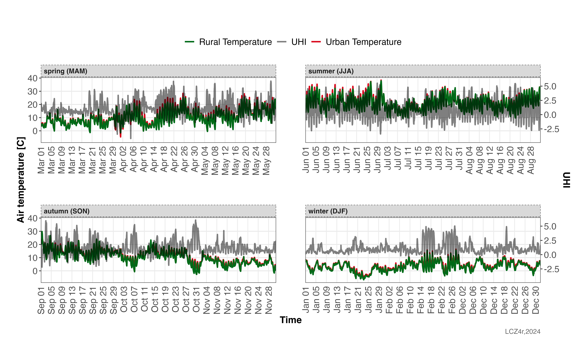
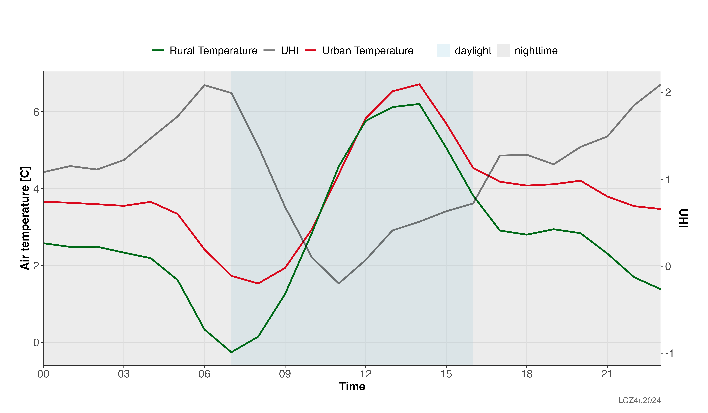

```{r, include = FALSE}
knitr::opts_chunk$set(
  collapse = TRUE,
  comment = "#>"
)
```

## Introduction

The `lcz_uhi_intensity()` function is designed to calculate the Urban Heat Island (UHI) intensity based on air temperature measurements and Local Climate Zones (LCZ).

This guide demonstrates how to use the lcz_uhi_intensity() function to calculate and analyze UHI intensity using LCZ classes. The function supports two calculation methods:

* 1. **LCZ Method**: Automatically identifies the LCZ build types, starting from LCZ 1 and progressing to LCZ 10, to represent the urban temperature, whilst it starts from LCZ natural LCZ (11-16) to represent the rural temperature
* 2. **Manual Method**: Allows users have the freedom to select stations as references for the urban and rural areas.

```{r eval=FALSE, message=FALSE, warning=FALSE}
# Get the LCZ map for your city
lcz_map <- lcz_get_map_euro(city="Berlin")

# Load sample data from LCZ4r
data("lcz_data")
```

## UHI time series

```{r eval=FALSE, message=FALSE, warning=FALSE}

#Calculate hourly UHI intensity by months of 2019
lcz_uhi_intensity(lcz_map, data_frame = lcz_data, 
       var = "airT", station_id = "station",
       time.freq = "hour", 
       method = "LCZ",
       year = 2019,
       by = "month")
```

```{r echo=F, out.width = '100%', fig.align='center'}
knitr::include_graphics("fig_local_uhi_1.png")
```

## UHI seasonality

```{r eval=FALSE, message=FALSE, warning=FALSE}

#Calculate hourly UHI intensity by season of 2019, including the urban and rural temperatures
lcz_uhi_intensity(lcz_map, data_frame = lcz_data, 
       var = "airT", station_id = "station",
       time.freq = "hour", 
       method = "LCZ",
       year = 2019,
       by = "season",
       group = TRUE)
```

```{r echo=F, out.width = '100%', fig.align='center'}

```

## UHI daytime and nighttime

```{r eval=FALSE, message=FALSE, warning=FALSE}

#Calculate diurnal cycle of UHI intensity
lcz_uhi_intensity(lcz_map, data_frame = lcz_data, 
       var = "airT", station_id = "station",
       time.freq = "hour", 
       method = "LCZ",
       year = 2019, month = 2, day = 6,
       by = "daylight",
       group = TRUE)
```

```{r echo=F, out.width = '100%', fig.align='center'}

```

Using the manual method to calculate the UHI intensity

```{r eval=FALSE, message=FALSE, warning=FALSE}

#Calculate diurnal cycle of UHI intensity by Feb and Jul of 2019 using the manual method
lcz_uhi_intensity(lcz_map, data_frame = lcz_data, 
       var = "airT", station_id = "station",
       time.freq = "hour", 
       year = 2019, month = c(2, 7), day = 6,
       method = "manual",
       Turban = "bamberger",
       Trural = "airporttxl",
       by = c("daylight", "month"),
       group = TRUE)
```

```{r echo=F, out.width = '100%', fig.align='center'}
knitr::include_graphics("fig_local_uhi_4.png")
```


## Have feedback or suggestions?
Do you have an idea for improvement or did you spot a mistake? We'd love to hear from you! Click the button below to create a new issue (Github) and share your feedback or suggestions directly with us.

<button type="button" class="btn" style="background-color: #008000; color: white; padding: .25rem .5rem; font-size: .75rem; border: none; border-radius: .25rem;">
  <a href='https://github.com/ByMaxAnjos/LCZ4r/issues/new' style="text-decoration: none; color: white;">
    Open an issue in the Github repository
  </a>
</button>
