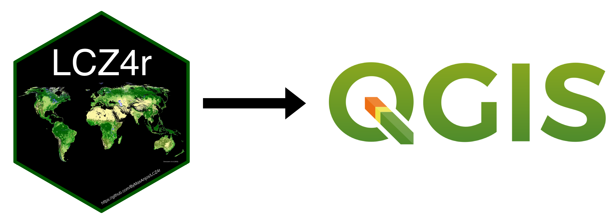

```{r, include = FALSE}
knitr::opts_chunk$set(
  collapse = TRUE,
  comment = "#>"
)
```

## Multilingual Integration in QGIS

It's coming up very soon...

```{r echo=F, out.width = '100%', fig.align='center'}

```


