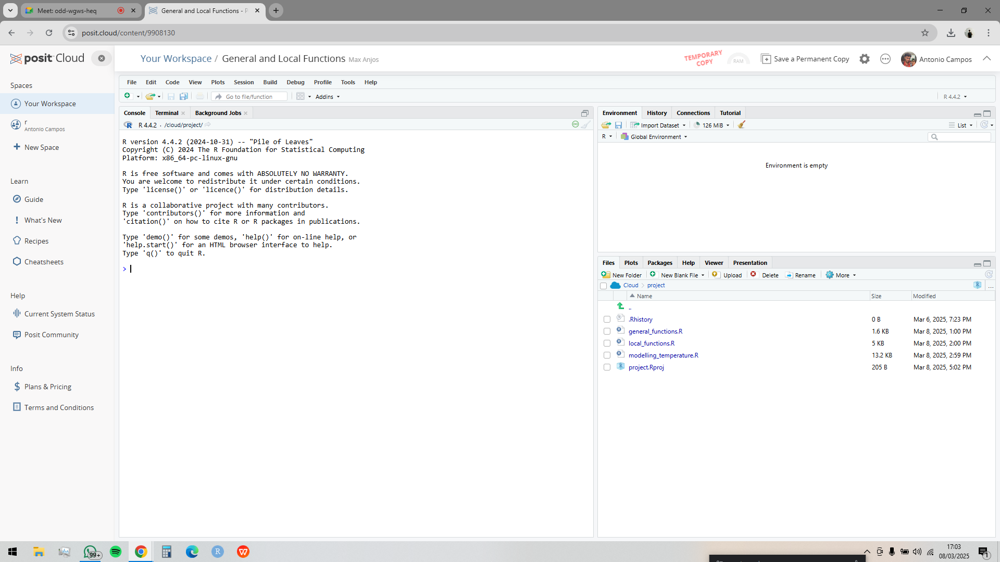

```{r, include = FALSE}
knitr::opts_chunk$set(
  collapse = TRUE,
  comment = "#>"
)
```

Welcome to the LCZ4r package demonstration on Posit Cloud! This guide will walk you through the steps to run LCZ4r and explore its powerful tools for Local Climate Zone (LCZ) analysis.

---

## Getting Started

To run LCZ4r in Posit Cloud, follow these steps:

**1. Access the Posit Workspace**:
Click on the following link to access the LCZ4r workspace:
LCZ4r::demo General and Local Functions: https://posit.cloud/content/9908130

**2. Log in or create an account (It's free!)**:

If you don’t already have a Posit Cloud account, create one.
Log in to your account to access the workspace.

**3. Make a Permanent Copy**:

Make sure to **make a Permanent Copy** of the project and workspace in your Posit Cloud account.

**4. Explore the R Scripts**:
The project contains three R scripts:

- **general_functions.R**: Demonstrates general functions for LCZ analysis, such as downloading and visualizing LCZ maps.

- **local_functions.R**: Focuses on localized LCZ analysis, including advanced geostatistical methods.

- **modelling_temperature.R**: Focuses on temperature interpolation and Urban Heat Island analysis.

**5.Run the Scripts**:

The LCZ4r package and all dependencies are already installed in the Posit Cloud environment, so you’re ready to go!

Simply open the scripts, run the code, and explore the results.

## Visualizing the Workspace

Below is a screenshot of the Posit Cloud workspace to help you get oriented:

```{r echo=F, out.width = '100%', fig.align='center'}

```


## Have feedback or suggestions?
Do you have an idea for improvement or did you spot a mistake? We'd love to hear from you! Click the button below to create a new issue (Github) and share your feedback or suggestions directly with us.

<button type="button" class="btn" style="background-color: #008000; color: white; padding: .25rem .5rem; font-size: .75rem; border: none; border-radius: .25rem;">
  <a href='https://github.com/ByMaxAnjos/QGIS-LCZ4r-Multilingual/issues/new'style="text-decoration: none; color: white;">
    Open an issue in the Github repository
  </a>
</button>
